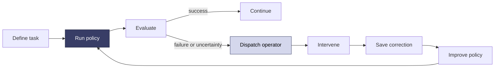

<Note>
  **Coming soon.** This page describes the workflow Sentinel is building. The complete eval, automated failure-routing, and intervention API is not available yet.
</Note>

Sentinel is building the workflow between teleoperation and full autonomy. Define a task, run a policy, measure each rollout, and send uncertain or failed cases to a human operator. Every intervention becomes structured evidence your team can review and use to improve the next version.

## The intended workflow

1. Define a task, its subtasks, and a success signal.
2. Collect and annotate initial human episodes.
3. Run policy rollouts on the robot.
4. Measure overall and per-subtask performance.
5. Let a person or evaluator model detect uncertainty or failure.
6. Pause, dispatch the case, or hand control to an available operator.
7. Save the correction and surrounding context as intervention data.
8. Use that data in your training pipeline and deploy the next policy version.
9. Automate the loop through the Sentinel API.

## What we are designing

- Eval definitions and rollout runs
- Task and subtask success metrics
- Human annotation during teleoperation
- Evaluator-model and external-system triggers
- Failure and uncertainty events
- Operator queues, dispatch, and takeover
- Intervention datasets
- API-driven orchestration and reporting

## Work with us

<Card title="Become a design partner" icon="comments" href="https://avea-robotics.slack.com" horizontal>
  Working on robot evals, supervised autonomy, or human intervention? Tell us about your workflow and help prioritize what Sentinel builds first.
</Card>
