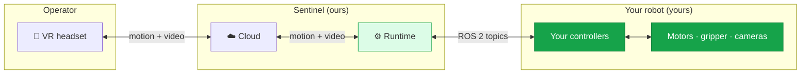
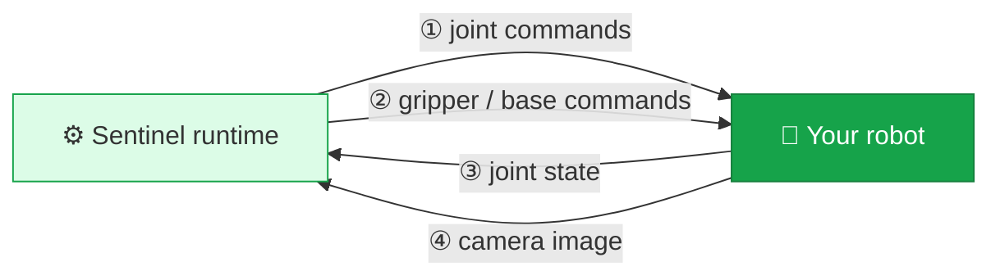

You don't need to know how Sentinel works inside to integrate. But understanding the shape of the system — where your robot sits and what crosses the boundary — makes the rest of these docs obvious.

## The big picture

The dividing line that matters for you is between the **runtime** and **your controllers**. Everything to the left of it is Sentinel. Everything to the right is the robot you already build and operate. The two halves talk over **standard ROS 2 topics**.

## The runtime

The runtime is the Sentinel software that runs near your robot. It does the heavy lifting that turns a person's hand motion into safe robot commands:

- Reads the operator's headset and controller motion.
- Figures out where your robot's hand should go and computes joint targets for it.
- Smooths and rate-limits those targets so motion is safe and stable.
- Sends commands to your robot and reads your robot's state back.
- Streams your camera feed up to the headset.

<Note>
  How the runtime does these things — the math, the safety logic, the tuning — is handled for you and configured in your config file. You interact with the runtime only through ROS 2 topics.
</Note>

## What crosses the boundary

Only four kinds of messages travel between the runtime and your robot. Each is a standard ROS 2 message.

| Direction | What it carries | Standard message type |
| --- | --- | --- |
| Runtime → robot | Joint targets for your arm | `trajectory_msgs/JointTrajectory` |
| Runtime → robot | Gripper open/close, mobile-base velocity | `JointTrajectory` / `Float64` / `geometry_msgs/Twist` |
| Robot → runtime | Where your joints are right now | `sensor_msgs/JointState` |
| Robot → runtime | The operator's video feed | `sensor_msgs/CompressedImage` |

The exact topic names are agreed on with us and written into your config file. The message types, units, and rates are fixed — those are the contract you build to. See [Robot control interface](/integration/robot-adapter) and [Camera interface](/integration/camera-adapter).

## Capabilities

Sentinel thinks of your robot as a set of **capabilities** — independent things it can do. You enable only the ones your robot has.

<CardGroup cols={2}>
  <Card title="Arm" icon="hand">
    A manipulator the operator moves with their hand. Driven by joint commands; reports joint state.
  </Card>
  <Card title="Gripper" icon="grip">
    An end-effector that opens and closes, controlled by a trigger or grip button.
  </Card>
  <Card title="Mobile base (locomotion)" icon="truck">
    A wheeled or legged base that drives around, controlled by a thumbstick.
  </Card>
  <Card title="Camera neck" icon="video">
    A pan/tilt head or camera that follows where the operator looks.
  </Card>
  <Card title="PTZ camera" icon="camera-rotate">
    A pan-tilt-zoom camera the operator aims and zooms independently of the robot's motion.
  </Card>
  <Card title="More — talk to us" icon="puzzle-piece">
    Have something else — a lift, a tool changer, a second sensor head? Tell us and we'll add support for it.
  </Card>
</CardGroup>

A single arm, a dual-arm rig, a mobile manipulator, or a humanoid are all just different combinations of these capabilities. You tell us which ones you have — including a camera neck, mobile base, PTZ head, or anything else — and we enable them in your config. If your robot does something not listed here, [reach out on Slack](https://avearobotics.com/slack); the capability set keeps growing.

## Next

<CardGroup cols={2}>
  <Card title="The state machine" icon="diagram-predecessor" href="/concepts/state-machine">
    When your robot is live, and when it isn't.
  </Card>
  <Card title="Robot control interface" icon="robot" href="/integration/robot-adapter">
    The exact contract for the four message flows above.
  </Card>
</CardGroup>
