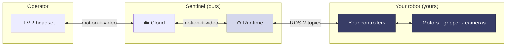
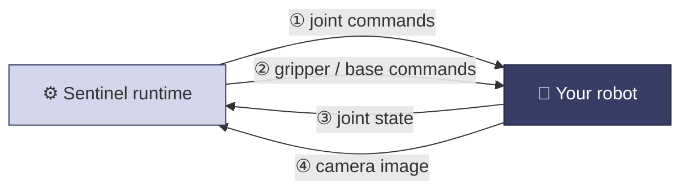

You don't need to know how Sentinel works inside. But knowing where your robot fits and what passes between the two sides makes the rest of these docs easy to follow.

## The big picture

The line that matters to you is between the **runtime** and **your controllers**. Everything to the left is Sentinel. Everything to the right is the robot you already build and run. The two sides talk over standard ROS 2 topics.

## The runtime

The runtime is the Sentinel software that runs near your robot. It turns a person's hand motion into robot commands:

- Reads the operator's headset and controller motion.
- Works out where your robot's hand should go and computes joint targets.
- Smooths and rate-limits the motion so it stays safe and stable.
- Sends commands to your robot and reads your robot's state back.
- Streams your camera feed to the headset.

<Note>
  How the runtime does this — the math, safety, and tuning — is set up for you in your config file. You only talk to the runtime through ROS 2 topics.
</Note>

## What passes between the two sides

Four kinds of messages move between the runtime and your robot. Each is a standard ROS 2 message.

| Direction | What it carries | Message type |
| --- | --- | --- |
| Runtime → robot | Joint targets for your arm | `trajectory_msgs/JointTrajectory` |
| Runtime → robot | Gripper open/close, base velocity | `JointTrajectory` / `Float64` / `geometry_msgs/Twist` |
| Robot → runtime | Where your joints are now | `sensor_msgs/JointState` |
| Robot → runtime | The camera feed | `sensor_msgs/CompressedImage` |

You pick the topic names and we put them in your config. The message types, units, and rates are fixed. See [Robot control interface](/integration/robot-adapter) and [Camera interface](/integration/camera-adapter).

## Capabilities

Sentinel treats your robot as a set of **capabilities** — separate things it can do. You enable the ones your robot has.

<CardGroup cols={2}>
  <Card title="Arm" icon="hand">
    A manipulator the operator moves with their hand. Takes joint commands and reports joint state.
  </Card>
  <Card title="Gripper" icon="grip">
    An end-effector that opens and closes, controlled by a trigger or grip button.
  </Card>
  <Card title="Mobile base" icon="truck">
    A wheeled or legged base that drives around, controlled by a thumbstick.
  </Card>
  <Card title="Camera neck" icon="video">
    A pan/tilt head or camera that follows where the operator looks.
  </Card>
  <Card title="PTZ camera" icon="camera-rotate">
    A pan-tilt-zoom camera the operator aims and zooms on its own.
  </Card>
  <Card title="More — ask us" icon="puzzle-piece">
    A hand, a lift, a tool changer, an extra sensor head? Tell us and we'll add it.
  </Card>
</CardGroup>

A single arm, a dual-arm rig, a mobile manipulator, or a humanoid are just different sets of these capabilities. Tell us which ones your robot has and we turn them on in your config. If your robot does something not listed, [ask us on Slack](https://avea-robotics.slack.com) — we keep adding support.

## Next

<CardGroup cols={2}>
  <Card title="State machine" icon="diagram-predecessor" href="/concepts/state-machine">
    When your robot is live, and when it isn't.
  </Card>
  <Card title="Robot control interface" icon="robot" href="/integration/robot-adapter">
    The four message flows in detail.
  </Card>
</CardGroup>
