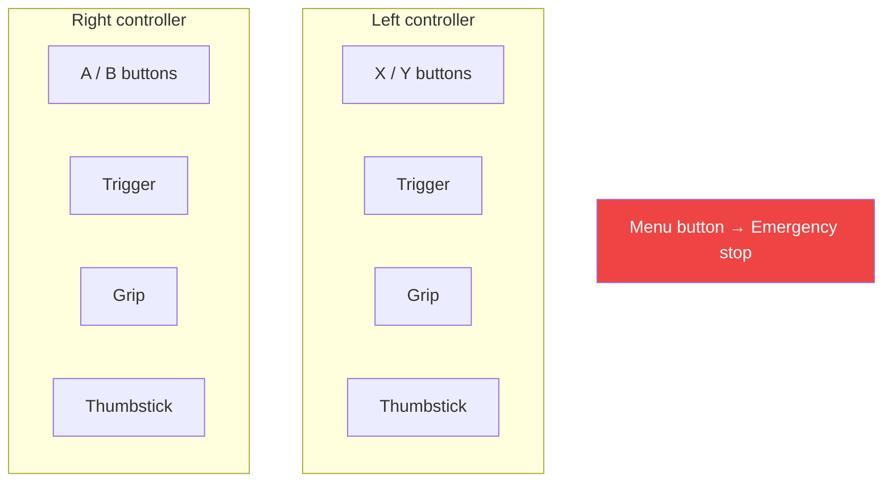
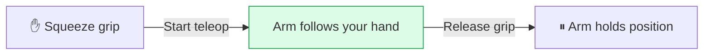

The operator holds two VR controllers. Their hand motion drives the arm, and the buttons run actions — arming, starting teleoperation, toggling the gripper, marking recordings. This page explains the default mappings so you know what the operator can trigger, and how those map onto your robot's actions.

<Note>
  **Every button mapping is remappable — just talk to us.** Mappings live in your config file, which we set up for you. The defaults below are a starting point; if a different button should arm the robot, start teleop, switch cameras, or fire one of your own actions, tell us and we'll change it. You don't wire any of this yourself.
</Note>

## The controllers

Each hand has the same set of inputs:

| Input | Type | Typical use |
| --- | --- | --- |
| **A / B** (right), **X / Y** (left) | Buttons | Run an action — arm, home, mark a recording |
| **Trigger** | Analog (0–1) | Control the gripper |
| **Grip** | Analog (0–1) | Hold to teleoperate (deadman) |
| **Thumbstick** | 2-axis | Drive a mobile base, adjust speed |
| **Menu** | Button | Emergency stop — always |

Buttons distinguish **single press**, **double press**, and **long press (hold)**, so one button can carry more than one action.

## Default mappings

These are sensible defaults for a single-arm robot. We adjust them to match your robot when we build your config.

| Control | Action |
| --- | --- |
| **Squeeze the grip** | Start teleoperation — the arm starts following your hand |
| **Release the grip** | Stop teleoperation — the arm holds position |
| **Trigger** | Open / close the gripper |
| **A — single press** | Arm the robot and move it to its start pose |
| **A — long press** | Send the robot home |
| **X — single press** | Start / stop recording an episode |
| **Y — single press** | Discard or flag the current recording |
| **Menu button** | Emergency stop |

### The grip is the deadman

The most important control is the **grip button as a deadman switch**. Teleoperation only happens while the operator holds the grip:

Let go and the arm stops following immediately. This maps directly to the [state machine](/concepts/state-machine): squeezing moves the robot into **teleop active**; releasing returns it to **armed**.

<Tip>
  On a dual-arm rig, each grip controls its own arm, and teleop stops when both are released. We handle this in your config.
</Tip>

## Mapping buttons to your robot's actions

Beyond the built-ins, a button can trigger one of **your** robot's actions. If your robot exposes something you'd want the operator to fire from the headset — switch a camera view, run a custom routine, toggle a tool — tell us, and we'll map a free button to it.

Two kinds of actions can be bound to a button:

<CardGroup cols={2}>
  <Card title="Built-in actions" icon="gear">
    Arm, home, start/stop teleop, recording controls, camera switching. Provided by Sentinel.
  </Card>
  <Card title="Your own action" icon="bolt">
    Any action your robot exposes that you'd like an operator to trigger. We map it to a free button.
  </Card>
</CardGroup>

<Note>
  When we map a button to one of your robot's actions, we'll agree on how the runtime signals it (for example, a topic or trigger your controller listens for). Bring your wishlist to the integration conversation.
</Note>

## Next

<CardGroup cols={2}>
  <Card title="Robot control interface" icon="robot" href="/integration/robot-adapter">
    The message contract for arm, gripper, and base commands.
  </Card>
  <Card title="Your config file" icon="file-pen" href="/integration/configuration">
    Where button mappings (and everything else) are set up for you.
  </Card>
</CardGroup>
