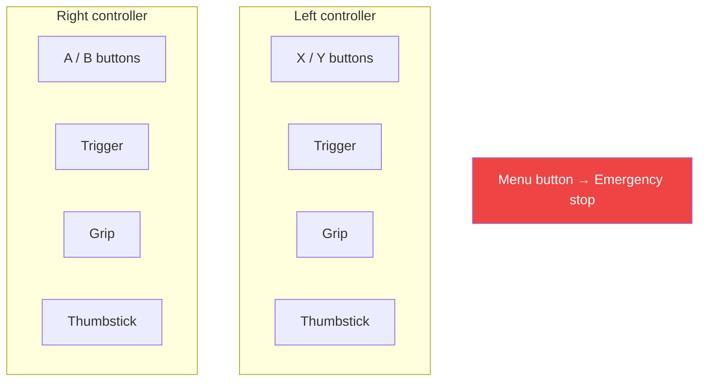
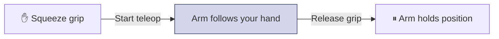

The operator holds two VR controllers. Hand motion drives the arm, and the buttons run actions — arming, starting teleoperation, opening the gripper, marking recordings. This page covers the default mappings so you know what the operator can do.

<Note>
  Every button can be remapped — just ask. Mappings live in your config file, which we set up for you. The defaults below are a starting point. If you want a different button to arm the robot, start teleop, switch cameras, or run one of your own actions, tell us and we'll change it.
</Note>

## The controllers

Each hand has the same inputs:

| Input | Type | Used for |
| --- | --- | --- |
| **A / B** (right), **X / Y** (left) | Buttons | Run an action — arm, home, mark a recording |
| **Trigger** | Analog (0–1) | Control the gripper |
| **Grip** | Analog (0–1) | Hold to teleoperate (deadman) |
| **Thumbstick** | 2-axis | Drive a mobile base, adjust speed |
| **Menu** | Button | Emergency stop — always |

Buttons can tell apart a **single press**, **double press**, and **long press (hold)**, so one button can do more than one thing.

## Default mappings

A good starting point for a single-arm robot. We adjust these to match your robot.

| Control | Action |
| --- | --- |
| **Squeeze the grip** | Start teleoperation — the arm follows your hand |
| **Release the grip** | Stop teleoperation — the arm holds position |
| **Trigger** | Open and close the gripper |
| **A — single press** | Arm the robot and move it to its start pose |
| **A — long press** | Send the robot home |
| **X — single press** | Start or stop recording |
| **Y — single press** | Discard or flag the current recording |
| **Menu button** | Emergency stop |

### The grip is the deadman

The grip button is a deadman switch. The robot only teleoperates while the operator holds it.

Let go and the arm stops following right away. This is the same thing as the [state machine](/concepts/state-machine): squeezing moves the robot to **teleop active**, releasing returns it to **armed**.

<Tip>
  On a dual-arm robot, each grip controls its own arm, and teleop stops when both are released. We set this up in your config.
</Tip>

## Buttons for your own actions

A button can also run one of **your** robot's actions. If there's something you'd want the operator to trigger from the headset — switch a camera view, run a routine, toggle a tool — tell us and we'll map a spare button to it.

<CardGroup cols={2}>
  <Card title="Built-in actions" icon="gear">
    Arm, home, start and stop teleop, recording, camera switching. These come with Sentinel.
  </Card>
  <Card title="Your own actions" icon="bolt">
    Anything your robot can do that you want an operator to trigger. We map it to a spare button.
  </Card>
</CardGroup>

<Note>
  When we map a button to one of your actions, we'll agree on how the runtime signals it — for example, a topic your robot listens on. Bring your list when we set things up.
</Note>

## Next

<CardGroup cols={2}>
  <Card title="Robot control interface" icon="robot" href="/integration/robot-adapter">
    The messages for arm, gripper, and base commands.
  </Card>
  <Card title="Your config file" icon="file-pen" href="/integration/configuration">
    Where button mappings and everything else are set up.
  </Card>
</CardGroup>
