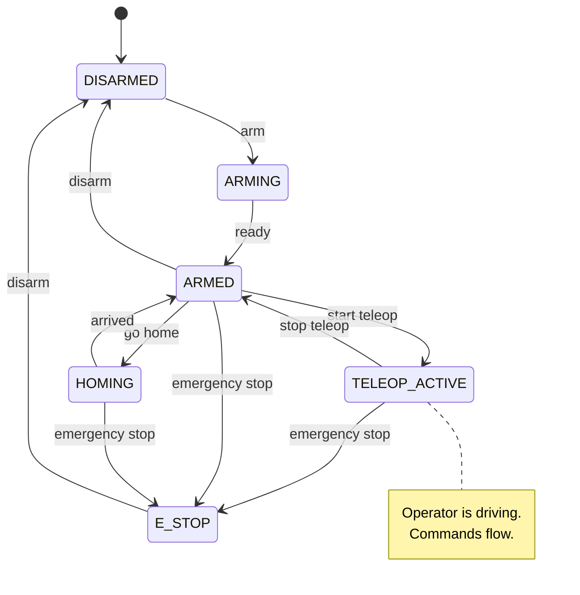
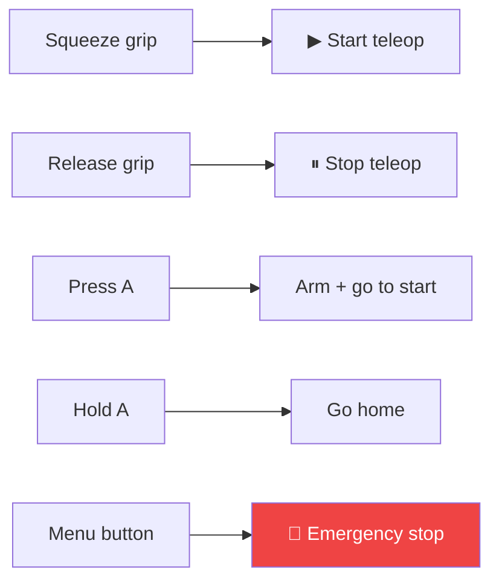

Sentinel always knows what mode your robot is in, and that mode decides whether commands reach your motors. Your robot acts on commands only during teleoperation — in every other mode it holds still, even when powered and ready.

## The states

| State | What it means | Do your motors move? |
| --- | --- | --- |
| **Disarmed** | Powered down or idle. The resting state. | No |
| **Arming** | Coming online and enabling motors. | Coming up |
| **Armed** | Powered and ready, but not taking operator input yet. Can run set moves like homing. | Only for set moves |
| **Homing** | Moving to a known home or start pose. | Yes — a planned move |
| **Teleop&nbsp;active** | The operator is driving the robot. | **Yes — operator commands** |
| **E‑stop** | Emergency stop. All motion halts at once. | No — stopped |

## Armed vs. teleoperating

<CardGroup cols={2}>
  <Card title="Armed" icon="circle-pause">
    Motors are on and the robot is ready, but no operator commands are coming. Your robot holds its current position.
  </Card>
  <Card title="Teleop active" icon="circle-play">
    The operator is driving. Joint, gripper, and base commands stream to your robot, and you move to match.
  </Card>
</CardGroup>

The two are separate so the robot can be powered, homed, and standing by without moving the moment it comes online. The operator starts teleoperation on purpose — by squeezing a grip, see [Controllers](/concepts/controllers) — and only then does your robot start following their hand.

<Warning>
  Hold position when armed; move when teleoperating. Sentinel stops sending arm commands when teleop stops, so don't assume commands are always arriving.
</Warning>

## How states change

The operator changes states with controller buttons. The runtime also changes some on its own (for example, arriving home returns to **armed**). You don't trigger these — you just react to whether commands are arriving.

These are the defaults, and they're configurable. See [Controllers and buttons](/concepts/controllers).

## What your robot should do

<Steps>
  <Step title="Always report state">
    Publish your joint state all the time, in every mode — even disarmed. The runtime needs to know where you are before it will arm. See the [control interface](/integration/robot-adapter).
  </Step>
  <Step title="Hold still unless teleoperating">
    When armed but not teleoperating, keep your current position.
  </Step>
  <Step title="Move during teleop">
    When teleop is active, run the joint, gripper, and base commands as they arrive.
  </Step>
  <Step title="Stop on e-stop">
    Treat an emergency stop as an immediate, safe halt of all motion.
  </Step>
</Steps>

## Next

<Card title="Controllers and buttons" icon="gamepad" href="/concepts/controllers" horizontal>
  How the operator arms the robot and starts teleoperation.
</Card>
