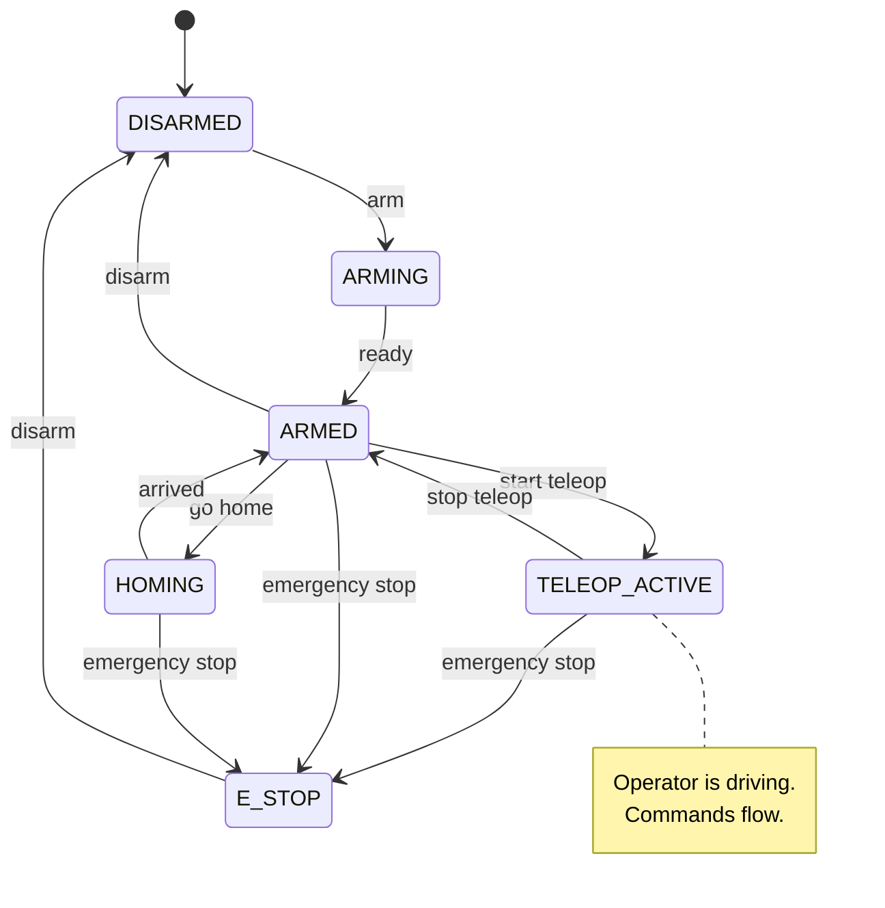
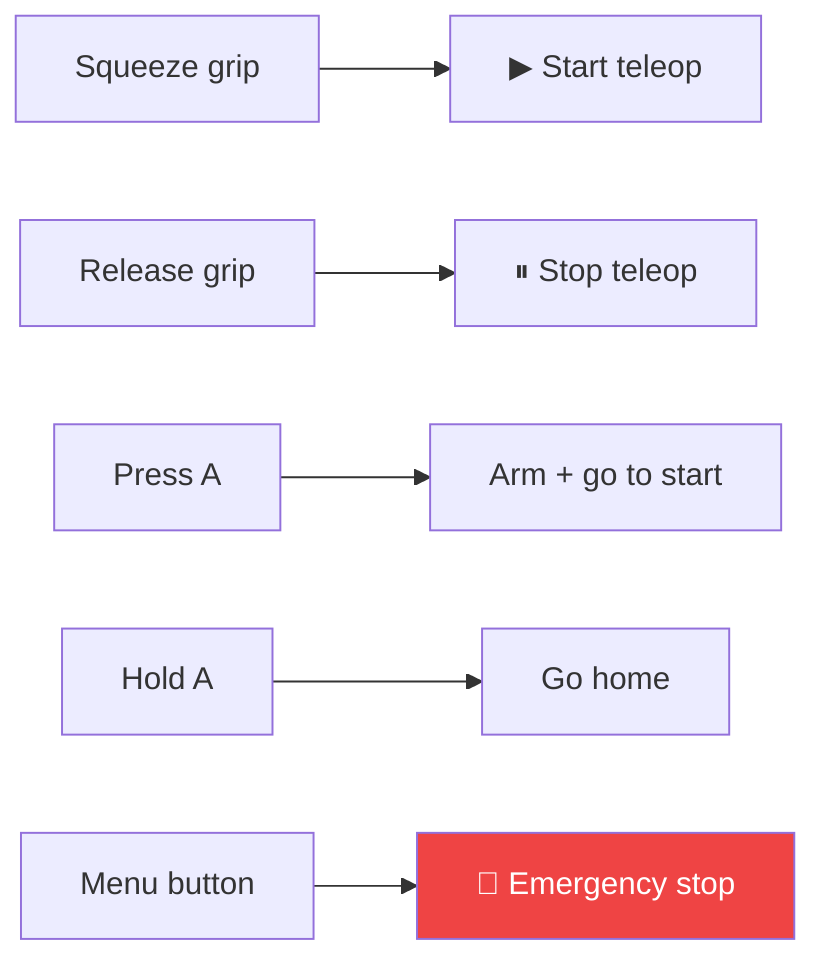

Sentinel always knows what mode your robot is in, and that mode controls whether commands reach your motors. Understanding it answers the most important integration question: **when should my controllers act on commands?**

The short version: **commands only flow during teleoperation.** In every other state your robot should hold still, even if it's powered and ready.

## The states

| State | What it means | Do your motors move? |
| --- | --- | --- |
| **Disarmed** | Powered down or safely idle. The default resting state. | No |
| **Arming** | Coming online — enabling motors and getting ready. | Coming up |
| **Armed** | Powered and ready, but **not** taking operator input yet. Safe to run scripted moves like homing. | Only for scripted moves |
| **Homing** | Moving to a known home or start pose. | Yes — a planned, internal move |
| **Teleop&nbsp;active** | The operator is driving the robot live. | **Yes — operator commands** |
| **E‑stop** | Emergency stop. All motion halts immediately. | No — stopped |

## The key distinction: armed vs. teleoperating

This trips up most integrations, so it's worth being explicit.

<CardGroup cols={2}>
  <Card title="Armed" icon="circle-pause">
    Motors are enabled and the robot is ready. But **no operator commands are being sent.** Your robot should hold its current position. This is the safe staging state before teleop.
  </Card>
  <Card title="Teleop active" icon="circle-play">
    The operator is actively driving. **Joint commands now stream to your robot** and you should execute them. Gripper and base commands flow here too.
  </Card>
</CardGroup>

Why split them? So the robot can be powered, homed, and standing by — without lurching the moment it comes online. The operator deliberately starts teleoperation (by squeezing a grip, see [Controllers](/concepts/controllers)), and only then does your robot start following their hand.

<Warning>
  **Build your controllers to respect this.** Hold position when armed; follow commands when teleoperating. Sentinel stops sending arm commands when teleop stops, but your side should not assume a command stream is always present.
</Warning>

## How states change

The operator changes states with controller buttons; the runtime can also change them automatically (for example, arriving home returns to **armed**). You don't trigger these transitions — you react to the resulting command flow.

These are the default mappings and they're configurable. See [Controllers & buttons](/concepts/controllers).

## What this means for your robot

<Steps>
  <Step title="Always report state">
    Publish your joint state continuously, in **every** mode — even when disarmed. The runtime needs to know where you are before it will let you arm. See the [control interface](/integration/robot-adapter).
  </Step>
  <Step title="Hold still unless teleoperating">
    When armed (but not teleoperating), keep your current position. Don't expect or require a command stream.
  </Step>
  <Step title="Follow commands during teleop">
    When teleop is active, execute the joint, gripper, and base commands as they arrive.
  </Step>
  <Step title="Stop safely on e-stop">
    Treat an emergency stop as an immediate, safe halt of all motion.
  </Step>
</Steps>

## Next

<Card title="Controllers & buttons" icon="gamepad" href="/concepts/controllers" horizontal>
  How the operator arms the robot and starts teleoperation.
</Card>
