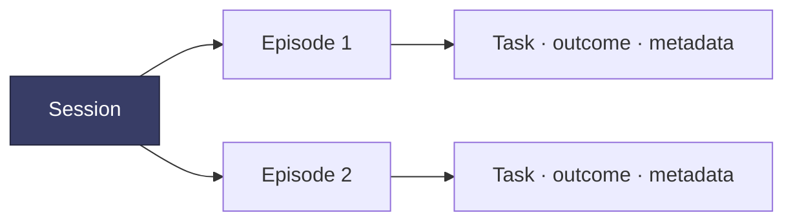

Sentinel can record robot work while a person teleoperates. Each recording becomes an **episode**: one attempt at a task, with synchronized robot state, commands, cameras, operator input, and system events.

## The basic model

- A **session** groups work performed during one connected operating period.
- An **episode** is one recorded attempt.
- A **task** describes the goal of the episode.
- A **subtask** marks a meaningful segment within the task.
- An **outcome** records whether the attempt succeeded, failed, or should be excluded.

Local episode recording is available today. Richer task, subtask, outcome, cloud, and eval workflows are being added progressively.

## What Sentinel records

By default, an episode can contain:

- VR controller and headset input
- Measured robot joint and gripper state
- Robot and gripper commands
- Encoded camera streams
- State transitions, errors, and telemetry
- Episode metadata and annotations

The exact topics are configurable. See [Using your data](/data/using-your-data) for the directory layout and message definitions.

## A useful first dataset

<Steps>
  <Step title="Choose one repeatable task">
    Use a task with a visible start and finish, such as picking up one object and placing it in a marked area.
  </Step>
  <Step title="Keep conditions consistent">
    Fix the camera positions, workspace, object set, and start pose before collecting variations intentionally.
  </Step>
  <Step title="Record one attempt per episode">
    Start recording immediately before the attempt and stop immediately after it.
  </Step>
  <Step title="Mark the outcome">
    Preserve whether the attempt succeeded, failed, or should be discarded. Outcome quality matters more than raw episode count.
  </Step>
  <Step title="Review before scaling collection">
    Check the robot state, commands, video, timing, and metadata from a few episodes before collecting a large batch.
  </Step>
</Steps>

## From data collection to autonomy

The same episode model will support human demonstrations, policy rollouts, evals, and interventions. A failed policy rollout can be routed to a person; the correction can be stored as intervention data; and the next policy version can be evaluated against the same task and subtasks.

<Card title="Human-in-the-loop evals — Coming soon" icon="chart-line" href="/autonomy/overview" horizontal>
  See the rollout, failure detection, intervention, and improvement workflow we are designing.
</Card>
