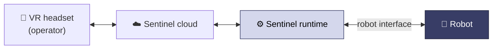

Sentinel is a container-based runtime for robot teleoperation. An operator in a VR headset drives a robot in real time — reaching, grasping, looking around, and moving — while each session is recorded as training data. The operator sees through the robot's cameras and moves it with their hands.

## How it works

The runtime runs on a computer near the robot. It converts the operator's hand motion into joint commands, drives the gripper and base, points the cameras, and streams video back to the headset. It sits between the headset and cloud and the robot's control interface.

The whole system is driven by a single `robot.yaml` — cameras, controls, robot capabilities, safety limits, and streaming all live there. See the [configuration reference](/configuration/reference).

## Setup paths

- **Robots that speak ROS 2** — the primary path. Your robot exposes a few standard topics (most `ros2_control` setups already do), you copy a pre-filled config and edit the marked fields. See [Connect over ROS 2](/integration/overview).
- **Supported hardware** runs from a ready-made config with nothing to integrate. Install the runtime, add the `robot.yaml`, and drive. See [Installation](/installation) and the [supported hardware list](/hardware/supported).

## Next steps

<CardGroup cols={2}>
  <Card title="Connect over ROS 2" icon="robot" href="/integration/overview">
    The topics your robot exposes and the pre-filled config that maps them.
  </Card>
  <Card title="Installation" icon="rocket" href="/installation">
    Install the runtime and drive your robot.
  </Card>
  <Card title="Configuration reference" icon="gears" href="/configuration/reference">
    Every section of `robot.yaml`.
  </Card>
  <Card title="Using your data" icon="database" href="/data/using-your-data">
    Recorded session layout and message formats.
  </Card>
</CardGroup>
