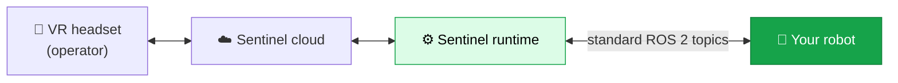

Sentinel lets a person wearing a VR headset drive your robot in real time — reaching, grasping, looking around, and moving — and records everything they do as training data. Your operator sees through the robot's cameras and moves the robot with their hands and the controllers.

This site is for **robot builders who want to connect their robot to Sentinel**. If your robot already runs ROS 2, you can integrate without writing any Sentinel-specific code. You expose a few standard ROS 2 topics, and Sentinel does the rest.

<Card title="See how integration works" icon="route" href="/quickstart" horizontal>
  The fastest path from "we have a robot" to "an operator is driving it in VR."
</Card>

## How it fits together

Sentinel sits between the VR headset and your robot. The headset and the cloud are ours. The robot — and the ROS 2 interface it exposes — is yours.

The **Sentinel runtime** runs near your robot. It takes the operator's hand motion, turns it into joint commands for your arm, sends gripper open/close commands, points your camera-neck, and streams your camera feed back up to the headset. Everything it sends to and receives from your robot travels over **plain ROS 2 topics that you already know how to publish and subscribe to**.

## What you provide

To integrate, your robot needs to do three things over ROS 2:

<CardGroup cols={3}>
  <Card title="Accept commands" icon="arrow-down-to-line">
    Subscribe to a command topic and move your joints, gripper, or base to match.
  </Card>
  <Card title="Report state" icon="arrow-up-from-line">
    Publish your current joint positions so Sentinel knows where the robot is.
  </Card>
  <Card title="Stream video" icon="video">
    Publish a compressed camera image so the operator can see.
  </Card>
</CardGroup>

That's the whole contract. The message types are standard ROS 2 messages — `JointTrajectory`, `JointState`, `Twist`, and `CompressedImage`. No custom message packages, no SDK to link against.

## What we provide

<CardGroup cols={2}>
  <Card title="The runtime" icon="microchip">
    The software that translates VR motion into robot commands, runs inverse kinematics, smooths trajectories, and enforces safety limits.
  </Card>
  <Card title="Your config file" icon="file-pen">
    We build a configuration file tailored to your robot — your topics, joints, and limits. You tell us your setup; we write it. <a href="/integration/configuration">Learn how →</a>
  </Card>
  <Card title="The cloud + headset" icon="cloud">
    Streaming, the VR application, recording, and dataset export.
  </Card>
  <Card title="Integration support" icon="headset">
    A real person to get you from first message to first teleoperation session.
  </Card>
</CardGroup>

<Note>
  **You don't write a config file by hand.** Sentinel's configuration captures deep details about kinematics, control, and safety. You describe your robot to us, and we generate and tune the config for you. These docs explain the parts you need to understand — the ROS 2 contract and the concepts behind the buttons and states — so you can build and test your side with confidence.
</Note>

## Where to go next

<CardGroup cols={2}>
  <Card title="Quickstart" icon="rocket" href="/quickstart">
    The integration journey, end to end.
  </Card>
  <Card title="How Sentinel connects" icon="diagram-project" href="/concepts/architecture">
    The pieces and how data flows between them.
  </Card>
  <Card title="The state machine" icon="diagram-predecessor" href="/concepts/state-machine">
    When your robot is armed, and when commands actually flow.
  </Card>
  <Card title="Robot control interface" icon="robot" href="/integration/robot-adapter">
    The exact topics, messages, and rates your controllers must support.
  </Card>
</CardGroup>
