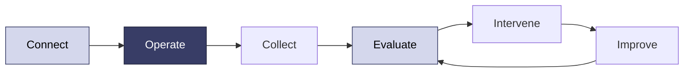

# Operate robots today. Build autonomy over time.

Sentinel is the operations and autonomy platform for real-world robots. Use it to control robots remotely in VR, collect structured data, understand how each run performed, and bring a person in when autonomy needs help.

You can start with one operator and one robot. As your system grows, Sentinel adds observability, evals, APIs, dispatching, and fleet operations around the same workflow.

<Card title="Get a robot running" icon="rocket" href="/quickstart" horizontal>
  Choose a supported robot or connect your own over ROS 2, then complete your first VR session.
</Card>

## The Sentinel loop

- **Connect:** use a first-class integration or map your ROS 2 interfaces.
- **Operate:** see through the robot's cameras and control it from a VR headset.
- **Collect:** record episodes with robot state, commands, video, and metadata.
- **Evaluate:** run a person or policy through the same task and measure the result.
- **Intervene:** let an operator label, correct, or take over a failed rollout.
- **Improve:** use the resulting data in your training pipeline and try again.

Today, Sentinel's strongest path is remote operation and structured data collection. Evals, failure routing, and deeper automation are being built on top of that foundation.

## Choose your path

<CardGroup cols={2}>
  <Card title="I have a supported robot" icon="robot" href="/hardware/supported">
    Start with a tested integration and ready-made configuration.
  </Card>
  <Card title="I have a ROS 2 robot" icon="diagram-project" href="/integration/overview">
    Connect standard command, state, and camera interfaces.
  </Card>
  <Card title="I will operate robots" icon="vr-cardboard" href="/operate/first-session">
    Learn the VR controls and complete a safe first session.
  </Card>
  <Card title="I am building a platform" icon="code" href="/platform/overview">
    See how provisioning, operations, data, eval, and fleet APIs fit together.
  </Card>
</CardGroup>

## One platform, three stages

<CardGroup cols={3}>
  <Card title="Operate" icon="hand">
    Connect a robot, control it in VR, and see its state from the dashboard.
  </Card>
  <Card title="Improve" icon="chart-line">
    Collect episodes, label subtasks and outcomes, and evaluate human or policy performance.
  </Card>
  <Card title="Scale" icon="layer-group">
    Supervise fleets, dispatch failures, and automate operations through APIs.
  </Card>
</CardGroup>

## Product status

<Note>
  These docs distinguish between features you can use now and workflows we are designing with customers. Pages marked **Coming soon** describe intended product direction, not currently available functionality.
</Note>

<CardGroup cols={2}>
  <Card title="Start with teleoperation" icon="circle-play" href="/quickstart">
    Install Sentinel and drive a robot in VR.
  </Card>
  <Card title="Explore human-in-the-loop autonomy" icon="wand-magic-sparkles" href="/autonomy/overview">
    See the eval and intervention workflow we are building.
  </Card>
</CardGroup>
