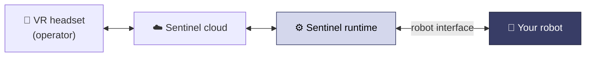

Sentinel lets a person in a VR headset drive your robot in real time — reaching, grasping, looking around, and moving — and records what they do as training data. The operator sees through your robot's cameras and moves it with their hands.

## Two ways to run Sentinel

<CardGroup cols={2}>
  <Card title="Supported hardware" icon="robot" href="/installation">
    On [supported hardware](/hardware/supported), we provide a tuned config. You install the runtime, drop in the config, and drive.
  </Card>
  <Card title="Your own robot" icon="diagram-project" href="/integration/overview">
    Running something else? Integrate it over standard ROS 2 — you expose a few topics and we adapt Sentinel to it.
  </Card>
</CardGroup>

Most customers are on the first path: you tell us about your robot, we send a `robot.yaml` and a license key, and you run it. Self-serve config creation is coming.

## How it fits together

Sentinel sits between the headset and your robot. The headset and cloud are ours. The robot is yours.

The **runtime** runs near your robot. It turns the operator's hand motion into joint commands, sends gripper and base commands, points your camera, and streams your camera feed back to the headset.

## What we handle

<CardGroup cols={2}>
  <Card title="The runtime" icon="microchip">
    Turns VR motion into robot commands: inverse kinematics, motion smoothing, and safety limits.
  </Card>
  <Card title="Your config" icon="file-pen">
    For supported hardware we write and tune the `robot.yaml` — your adapters, joints, cameras, and limits. <a href="/configuration/reference">What's in it →</a>
  </Card>
  <Card title="Cloud and headset" icon="cloud">
    Streaming, the VR app, recording, and dataset export.
  </Card>
  <Card title="Support" icon="headset">
    A person to help you from first message to driving the robot.
  </Card>
</CardGroup>

## Next

<CardGroup cols={2}>
  <Card title="Installation" icon="rocket" href="/installation">
    Install the runtime and drive your robot.
  </Card>
  <Card title="Quickstart" icon="route" href="/quickstart">
    The whole process, start to finish.
  </Card>
  <Card title="Configuration reference" icon="gears" href="/configuration/reference">
    Understand the sections of your `robot.yaml`.
  </Card>
  <Card title="Using your data" icon="database" href="/data/using-your-data">
    How sessions are recorded and the message formats.
  </Card>
</CardGroup>
