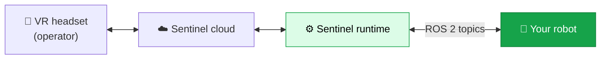

Sentinel lets a person in a VR headset drive your robot in real time — reaching, grasping, looking around, and moving — and records what they do as training data. The operator sees through your robot's cameras and moves it with their hands.

These docs are for robot builders connecting a robot to Sentinel. If your robot runs ROS 2, you don't write any Sentinel-specific code. You publish and subscribe to a few standard ROS 2 topics, and Sentinel handles the rest.

<Card title="How integration works" icon="route" href="/quickstart" horizontal>
  Start here for the steps from a ROS 2 robot to driving it in VR.
</Card>

## How it fits together

Sentinel sits between the headset and your robot. The headset and cloud are ours. The robot and its ROS 2 topics are yours.

The **runtime** runs near your robot. It turns the operator's hand motion into joint commands, sends gripper and base commands, points your camera, and streams your camera feed back to the headset. It talks to your robot over plain ROS 2 topics.

## What you do

Your robot needs to do three things over ROS 2:

<CardGroup cols={3}>
  <Card title="Accept commands" icon="arrow-down-to-line">
    Subscribe to a command topic and move your joints, gripper, or base to match.
  </Card>
  <Card title="Report state" icon="arrow-up-from-line">
    Publish your joint positions so Sentinel knows where the robot is.
  </Card>
  <Card title="Stream video" icon="video">
    Publish a compressed camera image so the operator can see.
  </Card>
</CardGroup>

These use standard ROS 2 messages — `JointTrajectory`, `JointState`, `Twist`, and `CompressedImage`. No custom message packages, no SDK.

## What we do

<CardGroup cols={2}>
  <Card title="The runtime" icon="microchip">
    Turns VR motion into robot commands: inverse kinematics, motion smoothing, and safety limits.
  </Card>
  <Card title="Your config file" icon="file-pen">
    We write the configuration for your robot — your topics, joints, and limits. You describe your setup; we build it. <a href="/integration/configuration">More →</a>
  </Card>
  <Card title="Cloud and headset" icon="cloud">
    Streaming, the VR app, recording, and dataset export.
  </Card>
  <Card title="Support" icon="headset">
    A person to help you go from first message to driving the robot.
  </Card>
</CardGroup>

<Note>
  You don't write the config file yourself. It holds detailed kinematics, control, and safety settings, so you describe your robot and we build and tune it for you. These docs explain what you need to know to set up your robot's ROS 2 side.
</Note>

## Next

<CardGroup cols={2}>
  <Card title="Quickstart" icon="rocket" href="/quickstart">
    The integration steps, start to finish.
  </Card>
  <Card title="How Sentinel connects" icon="diagram-project" href="/concepts/architecture">
    The pieces and how data moves between them.
  </Card>
  <Card title="State machine" icon="diagram-predecessor" href="/concepts/state-machine">
    When your robot is armed, and when commands flow.
  </Card>
  <Card title="Robot control interface" icon="robot" href="/integration/robot-adapter">
    The topics, messages, and rates your robot needs.
  </Card>
</CardGroup>
