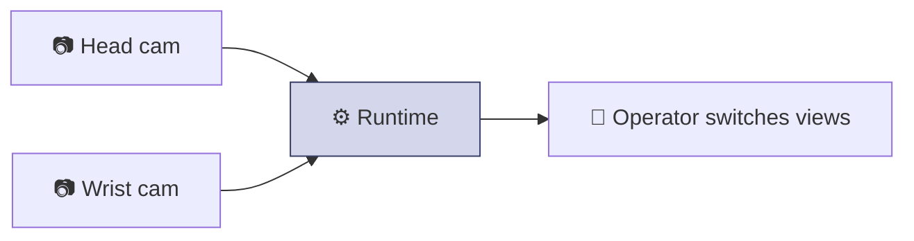

The operator drives your robot by looking through its cameras. To stream a feed, you publish a compressed image on a ROS 2 topic and the runtime forwards it to the headset. That's it.

If your camera already publishes to ROS 2 — most do — this is often just pointing us at a topic you already have.

## The flow


You publish, the runtime subscribes and streams it. Video is one-way — the runtime never sends anything back on this topic.

## What to publish

| Property | Value |
| --- | --- |
| Message type | `sensor_msgs/CompressedImage` (JPEG) |
| Direction | Your robot → runtime |
| Encoding | **JPEG** compressed frames |
| Rate | Whatever you publish — **30 fps is typical**, steady is what matters |
| QoS | Best-effort (dropping a frame is fine; latency is not) |

The frame rate and resolution are simply whatever your camera publishes — the runtime adapts. A steady ~30 fps gives a smooth operator view; higher is fine if your camera and network support it.

```python
# Conceptual — publish JPEG frames on a topic
msg = CompressedImage()
msg.header.stamp = now()
msg.format = "jpeg"
msg.data = jpeg_bytes          # your encoded frame
publisher.publish(msg)
```

<Note>
  Most ROS 2 cameras can publish a `CompressedImage` already (often a `.../compressed` topic). If yours does, integration is just telling us the topic name. If it only publishes raw images, a standard ROS 2 compression node gets you there.
</Note>

## Or let Sentinel open the camera

If the camera is plugged into the Sentinel computer (USB / UVC, Intel RealSense, or
ZED), you don't have to publish anything yourself — **Sentinel can open the camera
directly, capture and encode it, and publish the video topics for you.** You just
tell us the camera in your config; we handle capture and encoding.

|  | Publish it yourself | Let Sentinel open it |
| --- | --- | --- |
| Your camera | already on ROS 2 as `CompressedImage` | plugged into the Sentinel computer (USB / RealSense / ZED) |
| You do | point us at the topic | tell us the camera — nothing to run |
| To the headset | runtime forwards your topic | runtime captures, encodes, and publishes it |

In this mode Sentinel outputs encoded video on
`/sentinel/vision/output/{camera_name}/encoded` (`sentinel_msgs/EncodedImage`,
H.264/H.265) — the same topics it records. The full message definition is in
[Using your data](/data/using-your-data#encodedimage).

<Note>
  Tell us which cameras are attached and what each one is for; we add them to the
  `cameras:` section of your `robot.yaml` and Sentinel brings them up. Either path
  works per-camera — you can publish some feeds yourself and let Sentinel open others.
</Note>

## Multiple cameras

You can stream more than one camera — for example a head view and a wrist view. Each camera is its own topic and shows up as a separate view the operator can switch between.



Tell us how many cameras you have and what each one is for; we wire them into your config and map view-switching to a controller button if you want it. See [Controllers](/concepts/controllers).

## Build and test checklist

<Steps>
  <Step title="Publish a CompressedImage on a fixed topic">
    Confirm with `ros2 topic hz` that frames arrive at a steady rate.
  </Step>
  <Step title="Confirm the frames are JPEG">
    Check the message `format` field reads `jpeg` and the data decodes to an image.
  </Step>
  <Step title="Repeat for each camera">
    One topic per camera view.
  </Step>
  <Step title="Send us the topic names">
    We add each camera to your config.
  </Step>
</Steps>

<Tip>
  Lower latency beats higher resolution for teleoperation — the operator needs to feel in sync with the robot. Prefer a steady, low-latency stream over a high-resolution one that lags. We'll help you tune this during bring-up.
</Tip>

## Next

<Card title="Your config file" icon="file-pen" href="/integration/configuration" horizontal>
  How your topics, joints, and cameras come together into a working setup.
</Card>
