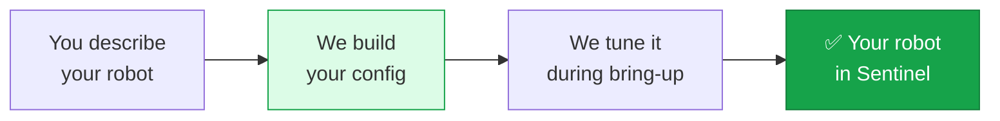

Everything about how Sentinel works with your robot lives in one configuration file: which topics to use, your robot's kinematics, how motion is smoothed, safety limits, button mappings, and which cameras to stream.

**You don't write this file by hand. We build and tune it with you.** This page explains what it captures and what we need from you, so the integration conversation is quick.

## Why we build it

The config holds details that need robotics expertise to get right — joint limits, inverse-kinematics behavior, motion smoothing, workspace bounds, safety margins. Getting these wrong is unsafe or makes teleoperation feel bad. Rather than ask you to learn all of it, you describe your robot and we generate a config tuned to it, then refine it together during bring-up.

## What the config captures

You don't edit these, but it helps to know what's in there:

<CardGroup cols={2}>
  <Card title="Topics" icon="diagram-project">
    The command, state, and camera topics from the [control](/integration/robot-adapter) and [camera](/integration/camera-adapter) interfaces.
  </Card>
  <Card title="Capabilities" icon="puzzle-piece">
    Which of arm, gripper, base, and camera-neck your robot has. See [architecture](/concepts/architecture).
  </Card>
  <Card title="Kinematics & limits" icon="ruler-combined">
    Joint names, ranges, and home poses — derived from your URDF.
  </Card>
  <Card title="Motion behavior" icon="wave-square">
    How the operator's hand maps to your robot, and how motion is smoothed and limited.
  </Card>
  <Card title="Safety" icon="shield-halved">
    Velocity caps, joint margins, and emergency-stop behavior.
  </Card>
  <Card title="Buttons & cameras" icon="gamepad">
    The controller mappings and which camera feeds appear. See [controllers](/concepts/controllers).
  </Card>
</CardGroup>

## What we need from you

Bring these to the integration conversation and we can move fast:

<Steps>
  <Step title="A description of your robot">
    What it is (single arm, dual-arm, mobile manipulator, humanoid), the gripper, and the cameras.
  </Step>
  <Step title="Your robot description (URDF)">
    The kinematic model. It gives us joint names, kinematics, and limits. You can send it as a file, or have us read it live from your `robot_state_publisher` (via a parameter or a latched topic). If you provide it live, your publisher must be up before the runtime starts — see [the control interface](/integration/robot-adapter#before-anything-your-robot-description-urdf).
  </Step>
  <Step title="Your topic names">
    The command, state, and camera topics you've set up per the [integration contract](/integration/overview) — or ask us to suggest names.
  </Step>
  <Step title="Any custom actions">
    Robot actions you'd like an operator to trigger from the headset, so we can map them to buttons.
  </Step>
</Steps>

<Note>
  Don't have all of this yet? That's fine — start the conversation anyway. The list above is what a complete config needs, not a prerequisite to reaching out.
</Note>

## How it evolves

Your config isn't frozen. As we tune motion smoothing, adjust limits, remap a button, or add a camera, the config updates — no changes to your robot's controllers required, as long as the [topic contract](/integration/overview) stays the same. That separation is the point: **your robot speaks standard ROS 2, and the config adapts Sentinel to it.**

## Ready to start?

<Card title="Talk to us on Slack" icon="slack" href="https://avea-robotics.slack.com" horizontal>
  Message us on <strong>Slack</strong> with a description of your robot — including any neck, mobile base, PTZ head, or other extras — and we'll build your config and get you teleoperating. Don't have a shared channel yet? Ask us for one.
</Card>
