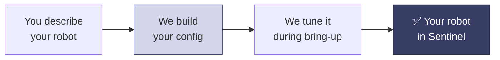

Everything about how Sentinel works with your robot lives in one config file: which topics to use, your robot's kinematics, how motion is smoothed, safety limits, button mappings, and which cameras to stream.

You don't write this file yourself — we build and tune it with you. This page covers what's in it and what we need from you.

## Why we build it

The config holds settings that take robotics experience to get right: joint limits, inverse kinematics, motion smoothing, workspace bounds, and safety margins. Get them wrong and the robot is either unsafe or feels bad to drive. So you describe your robot, we write a config for it, and we tune it together during bring-up.

## What's in it

You don't edit these, but it helps to know what's there:

<CardGroup cols={2}>
  <Card title="Topics" icon="diagram-project">
    The command, state, and camera topics from the [control](/integration/robot-adapter) and [camera](/integration/camera-adapter) interfaces.
  </Card>
  <Card title="Capabilities" icon="puzzle-piece">
    Which of arm, gripper, base, neck, and so on your robot has. See [architecture](/concepts/architecture).
  </Card>
  <Card title="Kinematics and limits" icon="ruler-combined">
    Joint names, ranges, and home poses, from your URDF.
  </Card>
  <Card title="Motion" icon="wave-square">
    How the operator's hand maps to your robot, and how motion is smoothed and limited.
  </Card>
  <Card title="Safety" icon="shield-halved">
    Velocity caps, joint margins, and emergency-stop behavior.
  </Card>
  <Card title="Buttons and cameras" icon="gamepad">
    The controller mappings and which camera feeds show up. See [controllers](/concepts/controllers).
  </Card>
</CardGroup>

## What we need from you

Bring these when we set things up and it goes quickly:

<Steps>
  <Step title="A description of your robot">
    What it is (single arm, dual-arm, mobile manipulator, humanoid), the gripper, and the cameras.
  </Step>
  <Step title="Your robot description (URDF)">
    Gives us joint names, kinematics, and limits. Send it as a file, or have us read it live from your `robot_state_publisher`. If it's live, your publisher has to be up before the runtime starts — see [the control interface](/integration/robot-adapter#first-your-robot-description-urdf).
  </Step>
  <Step title="Your topic names">
    The command, state, and camera topics you've set up (see the [overview](/integration/overview)), or ask us to suggest names.
  </Step>
  <Step title="Any custom actions">
    Things you'd like an operator to trigger from the headset, so we can map them to buttons.
  </Step>
</Steps>

<Note>
  Don't have all of this yet? Start the conversation anyway. This is what a finished config needs, not what you need before reaching out.
</Note>

## It can change anytime

The config isn't frozen. When we tune motion, adjust limits, remap a button, or add a camera, only the config changes — your robot's controllers stay the same, as long as the topics stay the same. That's the idea: your robot speaks standard ROS 2, and the config adapts Sentinel to it.

## Ready to start?

<Card title="Talk to us on Slack" icon="slack" href="https://avea-robotics.slack.com" horizontal>
  Message us with a description of your robot — including any neck, mobile base, PTZ head, or other extras — and we'll build your config and get you driving it. No shared channel yet? Ask us for one.
</Card>
