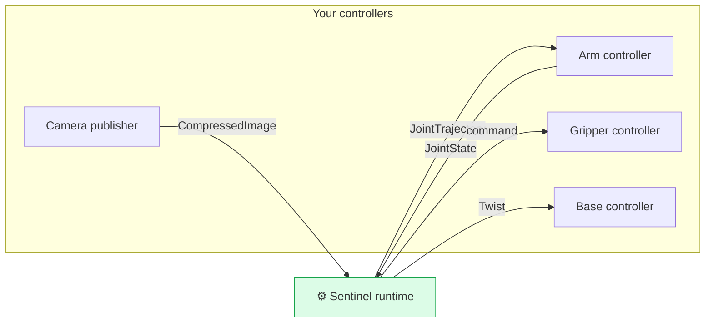

This section is the technical heart of self-serve integration. It defines exactly what your robot must publish and subscribe to — the topics, message types, units, and rates — so you can build and test your side before we ever connect.

## The contract at a glance

Your robot speaks to Sentinel over a handful of standard ROS 2 topics. Implement the ones for the capabilities you have.

| Capability | You subscribe to (command) | You publish (state / data) |
| --- | --- | --- |
| **Arm** | `trajectory_msgs/JointTrajectory` | `sensor_msgs/JointState` |
| **Gripper** | `JointTrajectory` / `Float64` | `sensor_msgs/JointState` *(optional)* |
| **Mobile base (locomotion)** | `geometry_msgs/Twist` | — |
| **Camera neck** | head-pointing command | — |
| **PTZ camera** | pan / tilt / zoom command | — |
| **Camera** | — | `sensor_msgs/CompressedImage` |

All topic names are agreed with us and written into your config. The message types, units, and timing below are fixed — that's what you build to.

<Note>
  **Got more than an arm?** Mobile base, camera neck, and PTZ are fully supported, and the pattern is the same as everything else — standard ROS 2 topics, with the exact messages agreed with us. Have something not in this list? [Talk to us on Slack](https://avea-robotics.slack.com) and we'll define the contract with you and add it to your config.
</Note>

## Two integration surfaces

<CardGroup cols={2}>
  <Card title="Robot control interface" icon="robot" href="/integration/robot-adapter">
    Arm, gripper, and mobile-base control. How to receive commands and report joint state, with units and rates.
  </Card>
  <Card title="Camera interface" icon="video" href="/integration/camera-adapter">
    How to stream a camera feed to the operator's headset over a standard image topic.
  </Card>
</CardGroup>

## Ground rules

A few rules apply across every interface. They come straight from the [state machine](/concepts/state-machine).

<Steps>
  <Step title="Report state continuously, in every mode">
    Publish joint state all the time — even when disarmed. The runtime won't let the robot arm until it sees your state.
  </Step>
  <Step title="Only act on commands during teleoperation">
    Hold position when armed but not teleoperating. Don't assume commands are always streaming.
  </Step>
  <Step title="Use SI units">
    Radians for joint angles, radians/second for joint velocity, meters/second and radians/second for base motion. Never degrees.
  </Step>
  <Step title="Match the agreed QoS">
    We'll tell you the QoS for each topic (typically best-effort for high-rate state and video, reliable for commands). Mismatched QoS means topics silently won't connect.
  </Step>
</Steps>

<Tip>
  You can build and test your controllers against ordinary ROS 2 tools — publish a fake `JointState`, echo the command topic, confirm your robot moves — long before connecting to Sentinel. If your controllers behave correctly with plain `ros2 topic` commands, they'll behave correctly with Sentinel.
</Tip>
