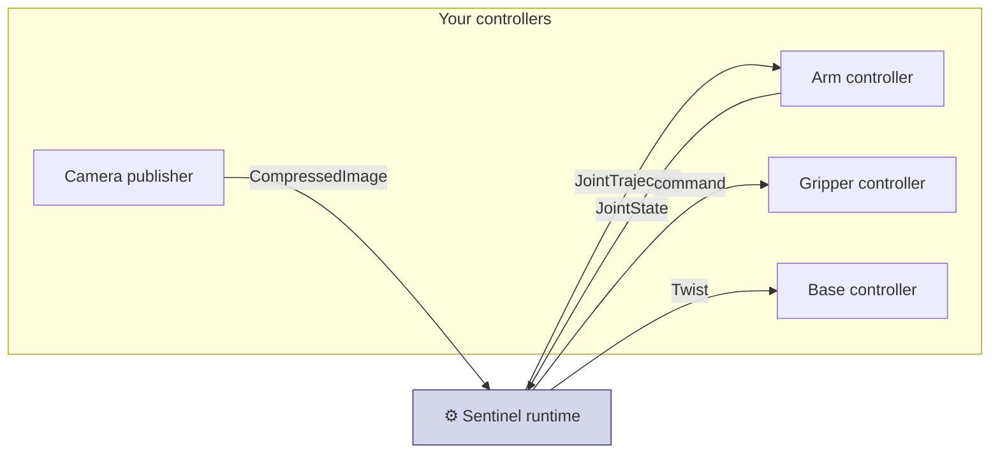

This section is for **integrating a robot we don't have a prebuilt adapter for**. If your hardware is on the [supported list](/hardware/supported), you don't need any of this — we send you a config and you [install and run](/installation). Otherwise, read on: you expose a few standard ROS 2 topics and we adapt Sentinel to them.

It covers what your robot publishes and subscribes to — the topics, message types, units, and rates. You can set this up and test it on your own before we connect anything.

## At a glance

Your robot talks to Sentinel over a few standard ROS 2 topics. Set up the ones for the capabilities you have.

| Capability | You subscribe to (command) | You publish (state / data) |
| --- | --- | --- |
| **Arm** | `trajectory_msgs/JointTrajectory` | `sensor_msgs/JointState` |
| **Gripper** | `JointTrajectory` / `Float64` | `sensor_msgs/JointState` *(optional)* |
| **Mobile base** | `geometry_msgs/Twist` | — |
| **Camera neck** | head-pointing command | joint state *(if joint-driven)* |
| **Dexterous hand** | finger joint command | finger joint state *(optional)* |
| **Elevator / torso lift** | height or velocity command | — |
| **PTZ camera** | pan / tilt / zoom command | — |
| **Camera** | — | `sensor_msgs/CompressedImage` |

You pick the topic names and we put them in your config. The message types, units, and rates below are fixed.

<Note>
  More than an arm? Mobile base, camera neck, hand, lift, and PTZ all work the same way — standard ROS 2 topics, with the exact messages settled with you. Got something not in the list? [Ask us on Slack](https://avea-robotics.slack.com) and we'll add it.
</Note>

## The two parts

<CardGroup cols={2}>
  <Card title="Robot control interface" icon="robot" href="/integration/robot-adapter">
    Arm, gripper, and base. Receiving commands and reporting joint state, with units and rates.
  </Card>
  <Card title="Camera interface" icon="video" href="/integration/camera-adapter">
    Streaming a camera feed to the headset over a standard image topic.
  </Card>
</CardGroup>

## A few rules

These apply everywhere and come from the [state machine](/concepts/state-machine).

<Steps>
  <Step title="Report state all the time">
    Publish joint state in every mode, even disarmed. The runtime won't arm the robot until it sees your state.
  </Step>
  <Step title="Only move during teleoperation">
    Hold position when armed but not teleoperating. Don't assume commands are always arriving.
  </Step>
  <Step title="Use SI units">
    Radians for joint angles, rad/s for joint velocity, m/s and rad/s for base motion. Never degrees.
  </Step>
  <Step title="Match the QoS we give you">
    We'll tell you the QoS for each topic — usually best-effort for high-rate state and video, reliable for commands. If it doesn't match, the topics won't connect.
  </Step>
</Steps>

<Tip>
  You can test your robot with plain ROS 2 tools before connecting to Sentinel: publish a fake `JointState`, echo the command topic, send a test command and watch the robot move. If it works with `ros2 topic`, it'll work with Sentinel.
</Tip>
