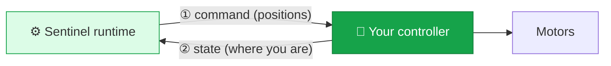
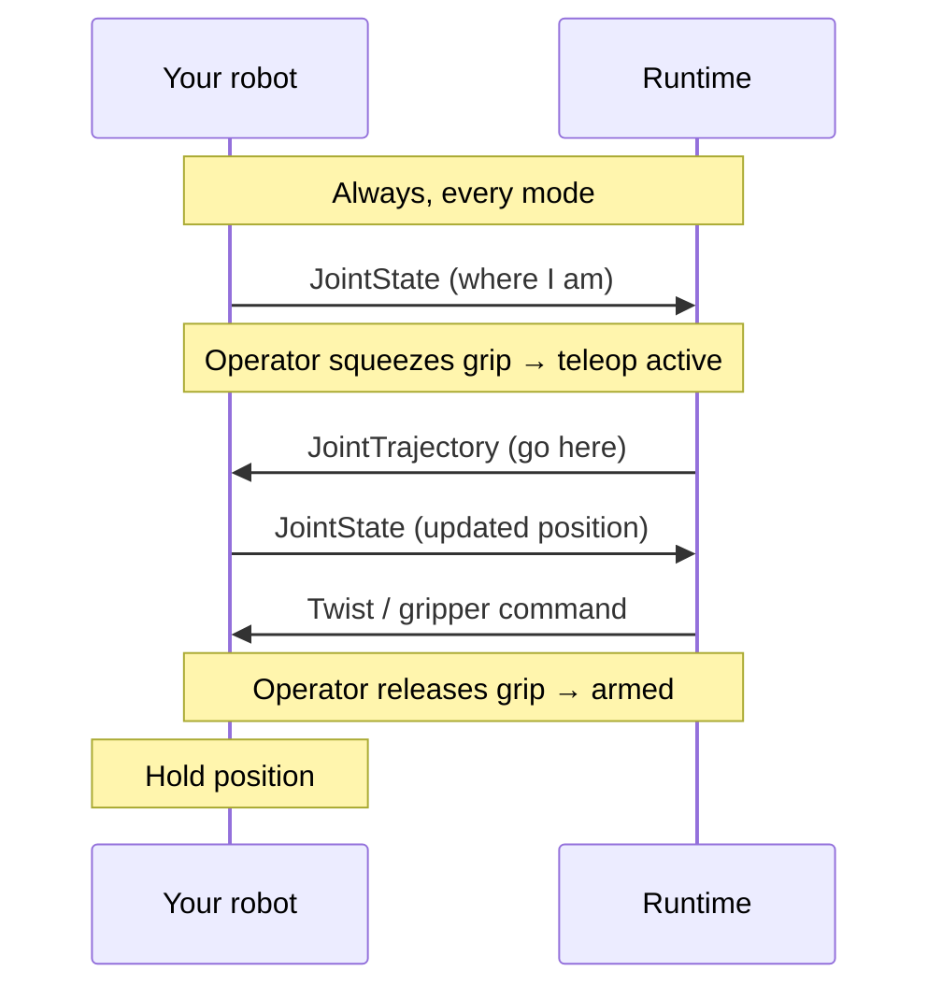

This is the contract for controlling your robot. If your robot runs ROS 2, you implement this with standard message types — no custom packages and no Sentinel code on your robot. You expose topics; the runtime publishes commands and reads your state.

Topic names are agreed with us and set in your config. Everything else on this page is fixed.

## The flow



Two loops:

- **Command in** — the runtime sends where it wants your joints to go.
- **State out** — you continuously report where your joints actually are.

Both must work. The state loop is not optional: the runtime needs your state to compute commands and to confirm the robot is healthy enough to arm.

## Arm: receiving commands

Subscribe to your command topic and move your joints to match.

| Property | Value |
| --- | --- |
| Message type | `trajectory_msgs/JointTrajectory` |
| Direction | Runtime → your robot |
| Units | Joint positions in **radians**, velocities in **rad/s** |
| Timing | Event-driven — execute each message as it arrives |
| When active | Only during **teleop active** ([why](/concepts/state-machine)) |

Each message names the joints it's commanding and carries one or more trajectory points. Read the joint names, match them to your joints, and command the target positions.

```python
# Conceptual — your controller's subscription callback
def on_command(msg: JointTrajectory):
    point = msg.points[-1]            # target positions (radians)
    for name, position in zip(msg.joint_names, point.positions):
        motor[name].set_target(position)
```

<Note>
  **Joint names come from your URDF, and ordering is remappable — just talk to us.** Sentinel learns your joint names and kinematics from the URDF you give us, so the names you already use are the names in the messages. You don't rename joints or reorder anything to match Sentinel — we handle the mapping in your config, and the same applies to the `JointState` you publish back. If your naming or ordering changes, tell us and we update the config; no controller changes needed. We'll walk you through this together during setup.
</Note>

## Arm: reporting state

Publish your current joint state continuously, in every mode.

| Property | Value |
| --- | --- |
| Message type | `sensor_msgs/JointState` |
| Direction | Your robot → runtime |
| Units | Positions in **radians**, velocities in **rad/s**, efforts in **Nm** (if available) |
| Rate | **Continuous and steady** — a few hundred Hz is typical; never let it stop |
| Required | **Yes** — and it must already be flowing before the robot can arm |

Populate `name`, `position`, and (recommended) `velocity`, with a real timestamp in the header.

```python
# Conceptual — publish at a steady rate, always
msg = JointState()
msg.header.stamp = now()
msg.name = ["joint_1", "joint_2", "joint_3", ...]
msg.position = [...]    # radians
msg.velocity = [...]    # rad/s
publisher.publish(msg)
```

<Warning>
  **Keep state flowing.** The runtime watches for fresh joint state. If it goes stale — your publisher stops or stalls — the runtime treats it as a fault and triggers an emergency stop. Publish at a steady rate at all times, in every state, even disarmed.
</Warning>

## Gripper

If your robot has a gripper, subscribe to a gripper command topic. We pick the message format that fits your hardware.

| Property | Value |
| --- | --- |
| Message type | `trajectory_msgs/JointTrajectory`, `std_msgs/Float64`, or `std_msgs/Float64MultiArray` |
| Direction | Runtime → your robot |
| Meaning | A normalized open amount, mapped to your gripper's real range in your config |
| Timing | Event-driven |

The runtime sends a normalized open/close command; your config maps it to your gripper's actual travel (so you don't hard-code limits in your controller). Optionally, publish gripper position back as a `sensor_msgs/JointState` so the operator sees real feedback.

<Note>
  Don't worry about the exact range or the message variant — we choose them with you based on your gripper and write them into the config. You just consume the topic and drive your gripper.
</Note>

## Mobile base

If your robot drives around, subscribe to a velocity command topic.

| Property | Value |
| --- | --- |
| Message type | `geometry_msgs/Twist` |
| Direction | Runtime → your robot |
| Units | Linear in **m/s**, angular in **rad/s** |
| Timing | Event-driven |

This is the standard ROS 2 velocity command. Use `linear.x` / `linear.y` and `angular.z` the way your base already expects.

## Camera neck, PTZ, and other capabilities

A **camera neck** (a pan/tilt head that follows the operator's gaze) and a **PTZ camera** (pan-tilt-zoom the operator aims independently) work the same way as everything on this page — your controller subscribes to a command topic over standard ROS 2 and drives the hardware. The same goes for less common capabilities like a lift, a tool changer, or an extra sensor head.

Because the right message format depends on your specific hardware, we define the exact topic and message for these **with you** rather than fixing it here. The contract is always ROS 2-native and follows the same rules: SI units, agreed QoS, act only during teleoperation.

<Card title="Setting up a neck, PTZ, or something else?" icon="slack" href="https://avearobotics.com/slack" horizontal>
  Tell us what the capability does and how your hardware is driven, and we'll define the contract and add it to your config.
</Card>

## Putting it together



## Build and test checklist

<Steps>
  <Step title="Publish joint state on a fixed topic, continuously">
    Verify with `ros2 topic echo` that positions look right and the rate is steady.
  </Step>
  <Step title="Subscribe to a command topic and move your joints">
    Publish a test `JointTrajectory` by hand and confirm your robot moves to the commanded positions.
  </Step>
  <Step title="Confirm units are radians and rates are steady">
    Double-check no degrees, and that your state publisher never stalls.
  </Step>
  <Step title="Add gripper and base if you have them">
    Repeat for the gripper command and `Twist`.
  </Step>
  <Step title="Share your topic names with us">
    We finalize the config so the runtime and your controllers line up.
  </Step>
</Steps>

<Tip>
  Already running `ros2_control`, MoveIt, or your own joint controller? You don't need to replace it. As long as something on your robot consumes a `JointTrajectory` and publishes `JointState`, you're compatible. Tell us your stack and we'll match the contract to it.
</Tip>

## Next

<Card title="Camera interface" icon="video" href="/integration/camera-adapter" horizontal>
  Stream your camera feed to the operator's headset.
</Card>
