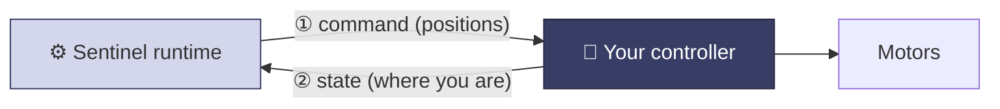
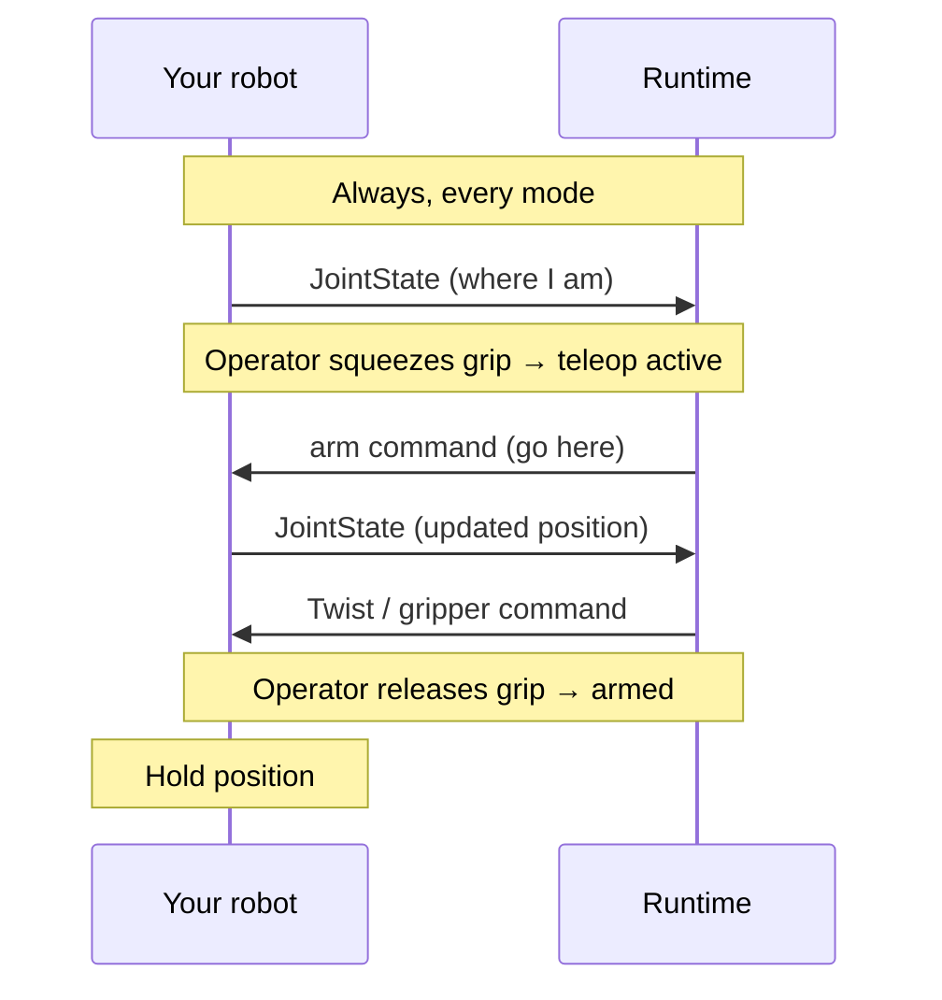

Here's how the runtime controls your robot. If your robot runs ROS 2, you do this with standard message types — no custom packages and no Sentinel code on your robot. You expose topics; the runtime sends commands and reads your state.

You pick the topic names and we put them in your config. Everything else on this page is fixed.

## The flow



Two loops:

- **Command in** — the runtime sends where it wants your joints to go.
- **State out** — you continuously report where your joints actually are.

Both must work. The state loop isn't optional — the runtime needs your state to compute commands and to confirm the robot is ready to arm.

## First: your robot description (URDF)

Sentinel needs your robot's URDF — the model of its joints and links — to run inverse kinematics, apply limits, and smooth motion. The runtime only talks to your robot over topics, but it still needs to know the robot's geometry to send safe commands.

You can give us the description three ways. Tell us which fits your setup:

| Source | What it is | When to use it |
| --- | --- | --- |
| **File** | A URDF/xacro file you send us | Simplest — your robot model rarely changes |
| **Parameter** | We read `robot_description` from your `robot_state_publisher` (or similar) node | You already run a node that holds the description |
| **Topic** | We subscribe to your latched `robot_description` topic | You publish the description the standard ROS 2 way |

<Warning>
  If you give us the description live (topic or parameter), it has to be available before Sentinel starts. The runtime waits about 10 seconds for it, then gives up and won't start. So make sure your `robot_state_publisher` — or whatever holds the description — is running and **latched** (so it reaches late subscribers) before the runtime launches. A file has no such timing requirement.
</Warning>

<Note>
  Once it has the description, the runtime republishes it on a latched `/<your-namespace>/robot_description` topic so the rest of the system has one copy. On a multi-arm robot, each arm has its own description — give each one its own namespaced topic rather than a single shared `/robot_description`. We sort this out with you.
</Note>

## Topic names

You choose the topic names and we put them in your config. There's no required name — just keep them clear and namespaced. A common convention:

| Flow | Example topic |
| --- | --- |
| Arm command | `/external/arm/joint_trajectory` |
| Arm command (forward position) | `/arm_forward_position_controller/commands` |
| Arm state | `/external/arm/joint_states` |
| Gripper command | `/external/gripper/command` |
| Base command | `/external/base/cmd_vel` |

The runtime and your controllers run on the **same `ROS_DOMAIN_ID`**, so discovery just works — no bridges or extra plumbing.

## Arm: receiving commands

Subscribe to your command topic and move your joints to match. Two command interfaces are supported — pick whichever your controller already speaks:

| | Named trajectory | Forward position (array) |
| --- | --- | --- |
| Message type | `trajectory_msgs/JointTrajectory` | `std_msgs/Float64MultiArray` |
| Joint identity | By name, in the message | By position in the array — the slot order is fixed in your config |
| Typical setup | `joint_trajectory_controller`, your own controller | `ros2_control` forward position controllers |

Both follow the same rules:

| Property | Value |
| --- | --- |
| Direction | Runtime → your robot |
| Units | Joint positions in **radians**, velocities in **rad/s** |
| Timing | Event-driven — execute each message as it arrives |
| When active | Only during **teleop active** ([why](/concepts/state-machine)) |

### Named trajectory

Each message names the joints it's commanding and carries one or more trajectory points. Read the joint names, match them to your joints, and command the target positions.

```python
# Conceptual — your controller's subscription callback
def on_command(msg: JointTrajectory):
    point = msg.points[-1]            # target positions (radians)
    for name, position in zip(msg.joint_names, point.positions):
        motor[name].set_target(position)
```

<Note>
  Joint names come from your URDF, and ordering can be remapped — just ask. Sentinel reads your joint names from the URDF you give us, so the names you already use are the names in the messages. You don't rename or reorder anything to match Sentinel; we handle the mapping in your config, and the same applies to the `JointState` you publish back. If your names or order change, tell us and we update the config — no changes on your side. We'll walk through this with you during setup.
</Note>

### Forward position controllers

If your robot runs a stock `ros2_control` forward position controller (`forward_position_controller` / `JointGroupPositionController`), there's nothing to build: the runtime publishes `std_msgs/Float64MultiArray` setpoints straight onto your controller's `commands` topic, in your controller's configured joint order.

The array is nameless — element *i* commands joint *i* — so the joint order is agreed once and fixed in your config. Your controller chases the latest message at its own loop rate. The runtime smooths every command through per-joint velocity, acceleration, and jerk limits before publishing, so consecutive setpoints are always close together.

In this mode:

- **One array stream per controller.** A dual-arm robot with two forward position controllers gets two independent command topics.
- **Uncommanded slots follow your reported state.** Slots the runtime hasn't commanded yet are filled from your last published `JointState`, so a command never moves a joint it isn't driving.
- **A gripper can ride in the array.** If your controller takes the gripper as one more slot of the arm array, see [Gripper](#gripper) below — no separate topic needed.

<Warning>
  Your `JointState` stream does double duty here: it's the runtime's safety feedback and the seed for uncommanded slots. Keep it steady, and make sure it covers every joint in the command array.
</Warning>

## Arm: reporting state

Publish your current joint state continuously, in every mode.

| Property | Value |
| --- | --- |
| Message type | `sensor_msgs/JointState` |
| Direction | Your robot → runtime |
| Units | Positions in **radians**, velocities in **rad/s**, efforts in **Nm** (if available) |
| Rate | **Continuous and steady** — match your controller's natural state rate (commonly 50–250 Hz). It must never go stale. |
| Required | **Yes** — and it must already be flowing before the robot can arm |

Populate `name`, `position`, and (recommended) `velocity`, with a real timestamp in the header.

```python
# Conceptual — publish at a steady rate, always
msg = JointState()
msg.header.stamp = now()
msg.name = ["joint_1", "joint_2", "joint_3", ...]
msg.position = [...]    # radians
msg.velocity = [...]    # rad/s
publisher.publish(msg)
```

<Warning>
  **Keep state flowing.** The runtime watches for fresh joint state. If it goes stale for longer than a short window — half a second by default — the runtime treats it as a fault and triggers an emergency stop. Publish at a steady rate at all times, in every state, even disarmed. Don't publish slower than a couple of Hz under any circumstances; a normal controller rate (tens to hundreds of Hz) is what you want.
</Warning>

## Gripper

If your robot has a gripper, subscribe to a gripper command topic. We pick the message format that fits your hardware.

| Property | Value |
| --- | --- |
| Message type | `trajectory_msgs/JointTrajectory`, `std_msgs/Float64`, or `std_msgs/Float64MultiArray` |
| Direction | Runtime → your robot |
| Meaning | A normalized open amount, mapped to your gripper's real range in your config |
| Timing | Event-driven |

The runtime sends a normalized open/close command, and your config maps it to your gripper's real travel — so you don't hard-code limits in your controller. You can also publish the gripper position back as a `sensor_msgs/JointState` so the operator sees feedback.

<Note>
  Using a forward position controller that takes the gripper as one more element of the arm command array? That works with no separate topic: your config names the gripper's slot, and the runtime merges the mapped gripper value into the array. Gripper commands go out immediately — even between arm commands — with the arm slots holding their last values.
</Note>

<Note>
  Don't worry about the exact range or which message type to use — we pick those with you based on your gripper and put them in the config. You just read the topic and drive your gripper.
</Note>

## Mobile base

If your robot drives around, subscribe to a velocity command topic.

| Property | Value |
| --- | --- |
| Message type | `geometry_msgs/Twist` |
| Direction | Runtime → your robot |
| Units | Linear in **m/s**, angular in **rad/s** |
| Timing | Event-driven |

This is the standard ROS 2 velocity command. Use `linear.x` / `linear.y` and `angular.z` the way your base already expects.

## More capabilities

The interface covers more than an arm. Each capability works the same way — your controller subscribes to a command topic (and publishes state where it makes sense) over standard ROS 2.

| Capability | What the operator drives | Typical command |
| --- | --- | --- |
| **Mobile base** | Driving around | `geometry_msgs/Twist` (covered above) |
| **Camera neck** | A head that points where they look | A joint trajectory, or a target pose |
| **Dexterous hand** | Multi-finger grasping | A finger joint command |
| **Elevator / torso lift** | Raising and lowering | A height or velocity command |
| **PTZ camera** | Aiming and zooming a camera | A pan/tilt/zoom velocity command |
| **Something else** | Lift, tool changer, extra sensor head… | We define it with you |

The right message depends on your hardware — a neck might take a joint trajectory or a pose, a lift might take a position or a velocity — so we settle the exact topic and message for each one with you. It's always standard ROS 2 and follows the same rules: SI units, the QoS we give you, move only during teleoperation, and publish state back when something needs it.

<Card title="Setting up a neck, PTZ, or something else?" icon="slack" href="https://avea-robotics.slack.com" horizontal>
  Tell us what it does and how your hardware is driven, and we'll add it to your config.
</Card>

## Putting it together



## Build and test checklist

<Steps>
  <Step title="Publish joint state on a fixed topic, continuously">
    Verify with `ros2 topic echo` that positions look right and the rate is steady.
  </Step>
  <Step title="Subscribe to a command topic and move your joints">
    Publish a test command by hand — a `JointTrajectory`, or a `Float64MultiArray` if you're on a forward position controller — and confirm your robot moves to the commanded positions.
  </Step>
  <Step title="Confirm units are radians and rates are steady">
    Double-check no degrees, and that your state publisher never stalls.
  </Step>
  <Step title="Add gripper and base if you have them">
    Repeat for the gripper command and `Twist`.
  </Step>
  <Step title="Share your topic names with us">
    We finalize the config so the runtime and your controllers line up.
  </Step>
</Steps>

<Tip>
  Already running `ros2_control`, MoveIt, or your own joint controller? You don't need to replace it. As long as something on your robot takes a `JointTrajectory` or a forward-position `Float64MultiArray` and publishes `JointState`, it works. Tell us your setup and we'll match it.
</Tip>

## Next

<Card title="Camera interface" icon="video" href="/integration/camera-adapter" horizontal>
  Stream your camera feed to the operator's headset.
</Card>
