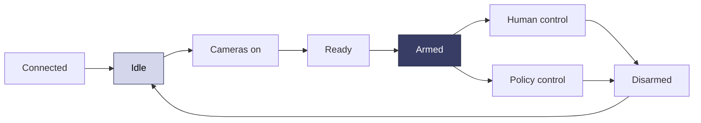

Sentinel is expanding from individual HTTPS actions into an API platform for the full robot lifecycle. The goal is to let your deployment scripts, applications, and fleet systems perform the same operations available in the dashboard and VR app.

<Note>
  **In development.** Public API coverage is still expanding. Contact us before designing a production integration around the capabilities described below.
</Note>

## One platform, five API areas

<CardGroup cols={2}>
  <Card title="Provisioning" icon="key">
    Create robots, issue credentials, assign licenses and entitlements, and resolve configuration.
  </Card>
  <Card title="Operations" icon="power-off">
    Bring up the runtime, start cameras, arm or disarm, run actions, and choose human or policy control.
  </Card>
  <Card title="Data" icon="database">
    Work with sessions, episodes, tasks, subtasks, outcomes, metrics, logs, and exports.
  </Card>
  <Card title="Autonomy" icon="brain">
    Define evals, run rollouts, report failures, capture interventions, and compare policy versions.
  </Card>
  <Card title="Fleet" icon="layer-group">
    Read fleet state, manage operators and queues, dispatch failures, and coordinate takeover.
  </Card>
</CardGroup>

## Persistent robot availability

Sentinel's planned daemon mode keeps a lightweight agent connected even when the complete robot stack is stopped. An authorized person or system will be able to move the robot through an explicit lifecycle:

That lifecycle will power controls in Flight Deck as well as programmatic workflows. Safety-sensitive transitions will require explicit permissions, valid preconditions, confirmation, timeouts, and audit events.

## Provision a robot from your own stack

The target provisioning flow is designed to fit factory and field-deployment scripts:

1. Create or select an organization.
2. Register the robot and its hardware profile.
3. Issue a credential or license key.
4. Assign entitlements.
5. Write or select the robot configuration.
6. Start the edge agent.
7. Verify connectivity and return a stable robot ID.

The workflow should be safe to run repeatedly without creating duplicate robots or credentials.

<Card title="Tell us what you need to automate" icon="comments" href="https://avea-robotics.slack.com" horizontal>
  Share your provisioning, eval, or fleet workflow and help shape the first public API surface.
</Card>
