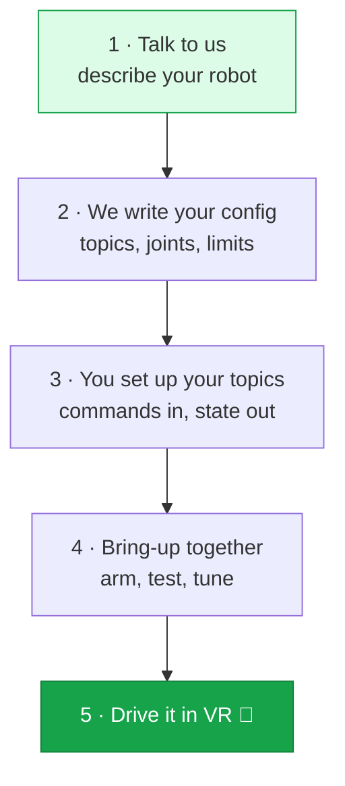

Here's the whole process, start to finish. You set up a few ROS 2 topics on your robot, we write your config file, and we bring it up together.

## Steps

<Steps>
  <Step title="Tell us about your robot">
    Message us on [Slack](https://avea-robotics.slack.com) and describe your setup: what kind of robot it is (arm, dual-arm, mobile base, humanoid), how many joints, what gripper and cameras you have, any extras like a camera neck or PTZ head, and how you run ROS 2 today.

    We'll ask for your URDF and the topic names you want to use.
  </Step>

  <Step title="We write your config file">
    Sentinel uses one config file that describes your robot's kinematics, motion settings, safety limits, button mappings, and topics. We write and tune it for you.

    You only need to know the topics and message types it uses, which we agree on together. [More about the config file →](/integration/configuration)
  </Step>

  <Step title="Set up your ROS 2 topics">
    On your robot:

    - **Subscribe** to a command topic and move your joints, gripper, or base to match.
    - **Publish** your joint state so Sentinel knows where the robot is.
    - **Publish** a compressed camera image for the operator's view.

    These use standard ROS 2 messages. The details are in [Robot control interface](/integration/robot-adapter) and [Camera interface](/integration/camera-adapter).
  </Step>

  <Step title="Bring it up together">
    We connect the runtime to your robot and walk through it: confirm state is flowing, **arm** the robot, run a homing move, then **start teleoperation**. We tune limits and motion smoothing for your hardware as we go.
  </Step>

  <Step title="Drive it and record">
    An operator puts on the headset and drives your robot. You can record each session as training data and export it in a standard format.
  </Step>
</Steps>

## Read these first

A few concepts make everything else easier to follow:

<CardGroup cols={2}>
  <Card title="How Sentinel connects" icon="diagram-project" href="/concepts/architecture">
    The runtime, the cloud, and where your robot fits.
  </Card>
  <Card title="State machine" icon="diagram-predecessor" href="/concepts/state-machine">
    The difference between **armed** and **teleoperating**, and when commands reach your motors.
  </Card>
  <Card title="Controllers and buttons" icon="gamepad" href="/concepts/controllers">
    What the operator's buttons do, and how teleop starts and stops.
  </Card>
  <Card title="Robot control interface" icon="robot" href="/integration/robot-adapter">
    The topics, messages, units, and rates your robot needs.
  </Card>
</CardGroup>

<Tip>
  Not sure how something maps to your robot? Ask us on [Slack](https://avea-robotics.slack.com) — we set this up with you.
</Tip>
