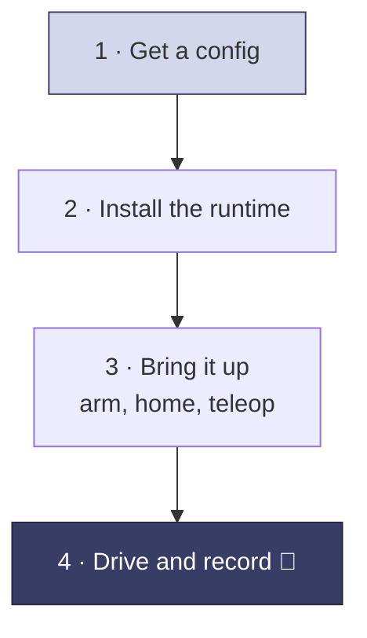

Sentinel runs as a container on a computer near the robot, driven by a single `robot.yaml`. The path from zero to driving:

## Steps

<Steps>
  <Step title="Get a config for your robot">
    Supported hardware has ready-made configs — see [Example configs](/configuration/examples). For hardware without a prebuilt adapter, connect over ROS 2: [Integrate your own adapter](/integration/overview). The [configuration reference](/configuration/reference) explains every section.
  </Step>

  <Step title="Install the runtime">
    Install the prerequisites and launch the container with your config on a computer near the robot. See [Installation](/installation).
  </Step>

  <Step title="Bring it up">
    Confirm joint state is flowing, **arm** the robot, run a homing move, then **start teleoperation** (the operator squeezes the grip). Tune limits and motion smoothing as needed.
  </Step>

  <Step title="Drive and record">
    The operator puts on the headset and drives. Each session records to MCAP for training — see [Using your data](/data/using-your-data).
  </Step>
</Steps>

## Concepts worth reading first

<CardGroup cols={2}>
  <Card title="Architecture" icon="diagram-project" href="/concepts/architecture">
    The runtime, the cloud, and where the robot fits.
  </Card>
  <Card title="State machine" icon="diagram-predecessor" href="/concepts/state-machine">
    **Armed** vs **teleoperating**, and when commands reach the motors.
  </Card>
  <Card title="Controllers and buttons" icon="gamepad" href="/concepts/controllers">
    What the operator's buttons do, and how teleop starts and stops.
  </Card>
  <Card title="Configuration reference" icon="gears" href="/configuration/reference">
    Every section of `robot.yaml`.
  </Card>
</CardGroup>

<Tip>
  Stuck mapping something to your robot? Reach the team on [Slack](https://avea-robotics.slack.com).
</Tip>
