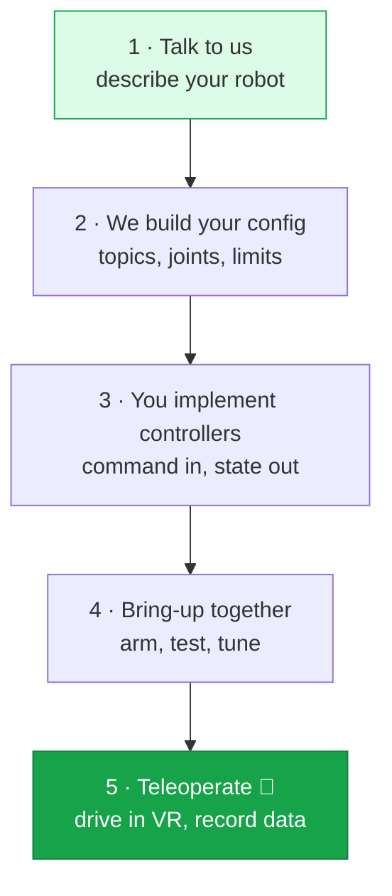

Integration is a short, guided process. You build a small ROS 2 interface on your robot, we build your configuration file, and together we bring up a live session. This page is the map.

## The journey

## Steps

<Steps>
  <Step title="Tell us about your robot">
    Message us on [Slack](https://avearobotics.com/slack) and describe your setup: what kind of robot it is (arm, dual-arm, mobile base, humanoid), how many joints, what gripper, what cameras, what extras like a camera neck or PTZ head, and how you run ROS 2 today.

    We'll ask for your URDF and the topic names you'd like to use. This conversation is what lets us build a config tuned to your hardware.
  </Step>

  <Step title="We build your configuration file">
    Sentinel is driven by a single configuration file that describes your robot's kinematics, control behavior, safety limits, button mappings, and which topics to use. **We write and tune this file for you** — it's the part that needs our expertise.

    You don't need to understand its internals. You only need to know the topics and message formats it expects, which we agree on together. [More on the config file →](/integration/configuration)
  </Step>

  <Step title="Implement your controllers">
    On your robot, implement the ROS 2 side of the contract:

    - **Subscribe** to a command topic and drive your joints / gripper / base to match.
    - **Publish** your current joint state continuously so Sentinel knows where you are.
    - **Publish** a compressed camera image for the operator's view.

    These use standard ROS 2 message types at defined rates. The full contract is in [Robot control interface](/integration/robot-adapter) and [Camera interface](/integration/camera-adapter).
  </Step>

  <Step title="Bring it up together">
    We connect the runtime to your robot and walk through bring-up: confirm state is flowing, **arm** the robot, run a homing move, then **start teleoperation**. We tune limits and motion smoothing for your hardware as we go.
  </Step>

  <Step title="Teleoperate and record">
    An operator puts on the headset and drives your robot. Every session can be recorded as training data, exported in a standard format.
  </Step>
</Steps>

## What you need to understand first

You don't need to learn Sentinel's internals, but a few concepts make the contract make sense. Read these before you start building:

<CardGroup cols={2}>
  <Card title="How Sentinel connects" icon="diagram-project" href="/concepts/architecture">
    The runtime, the cloud, and where your robot plugs in.
  </Card>
  <Card title="State machine" icon="diagram-predecessor" href="/concepts/state-machine">
    The difference between **armed** and **teleoperating** — and when commands actually reach your motors.
  </Card>
  <Card title="Controllers & buttons" icon="gamepad" href="/concepts/controllers">
    What the operator's buttons do, and how teleop is started and stopped.
  </Card>
  <Card title="Robot control interface" icon="robot" href="/integration/robot-adapter">
    The topics, messages, units, and rates your robot must support.
  </Card>
</CardGroup>

<Tip>
  Stuck or unsure how a concept maps to your robot? That's expected — integration is collaborative. Ping us on [Slack](https://avearobotics.com/slack) and we'll help.
</Tip>
