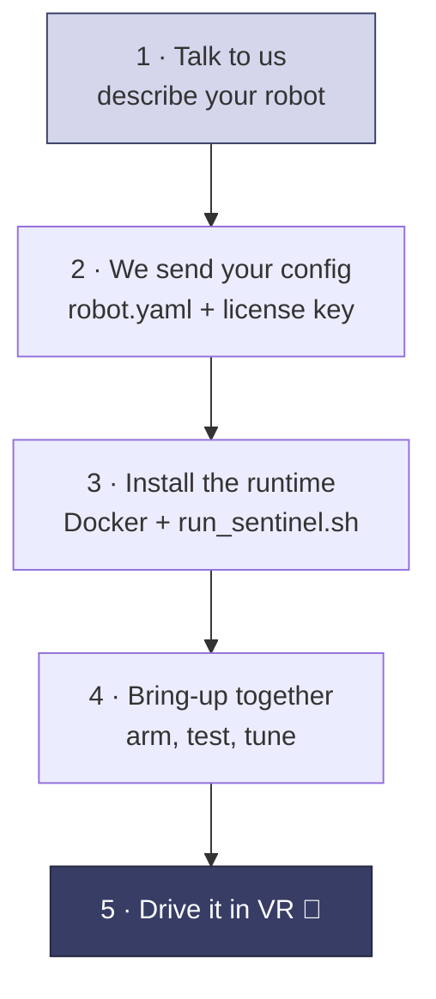

Here's the whole process for supported hardware, start to finish. You tell us about your robot, we send a tuned config and a license key, and you install and run it.

## Steps

<Steps>
  <Step title="Tell us about your robot">
    Message us on [Slack](https://avea-robotics.slack.com) and describe your setup: what kind of robot it is (arm, dual-arm, mobile base, humanoid), how many joints, what gripper and cameras you have, any extras like a camera neck or PTZ head, and how you run things today. Check [supported hardware](/hardware/supported) first.
  </Step>

  <Step title="We send your config and license key">
    For supported hardware we write and tune a `robot.yaml` for you — kinematics, motion, safety limits, button mappings, cameras, and adapters. You generate a license key in the [dashboard](https://dashboard.avearobotics.com/dashboard/robots). [What's in the config →](/configuration/reference)
  </Step>

  <Step title="Install and run the runtime">
    On a computer near your robot, install the prerequisites and launch the container with your config. See [Installation](/installation).
  </Step>

  <Step title="Bring it up together">
    We walk through it with you: confirm state is flowing, **arm** the robot, run a homing move, then **start teleoperation**. We tune limits and motion smoothing for your hardware as we go.
  </Step>

  <Step title="Drive it and record">
    An operator puts on the headset and drives your robot. Record each session as training data and export it in a standard format. See [Using your data](/data/using-your-data).
  </Step>
</Steps>

<Note>
  Running hardware we don't support yet? You can integrate your own robot over standard ROS 2 — see [Integrate your own adapter](/integration/overview).
</Note>

## Read these first

A few concepts make everything else easier to follow:

<CardGroup cols={2}>
  <Card title="How Sentinel connects" icon="diagram-project" href="/concepts/architecture">
    The runtime, the cloud, and where your robot fits.
  </Card>
  <Card title="State machine" icon="diagram-predecessor" href="/concepts/state-machine">
    The difference between **armed** and **teleoperating**, and when commands reach your motors.
  </Card>
  <Card title="Controllers and buttons" icon="gamepad" href="/concepts/controllers">
    What the operator's buttons do, and how teleop starts and stops.
  </Card>
  <Card title="Configuration reference" icon="gears" href="/configuration/reference">
    The sections of your `robot.yaml`.
  </Card>
</CardGroup>

<Tip>
  Not sure how something maps to your robot? Ask us on [Slack](https://avea-robotics.slack.com) — we set this up with you.
</Tip>
