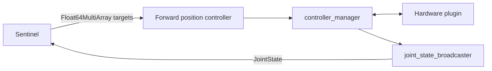

Use this path when `ros2_control` already owns the robot hardware. Keep that hardware stack in place. Sentinel publishes continuous position targets to a forward position controller and reads measured state from the joint-state broadcaster.



<Warning>
  Run only one controller manager and one hardware plugin against the robot. If another computer or appliance already owns the hardware, connect to its existing topics instead of launching a second `ros2_control_node`.
</Warning>

## What you need

Before configuring Sentinel, confirm that:

- `controller_manager` and the hardware plugin start without Sentinel.
- `joint_state_broadcaster` publishes every controlled joint continuously.
- A forward position controller accepts `std_msgs/msg/Float64MultiArray`.
- The controller holds or stops safely when command updates stop.
- You know the controller's fixed joint order.

## Configure the controllers

This single-arm example uses a joint-state broadcaster and a forward command controller:

```yaml
controller_manager:
  ros__parameters:
    update_rate: 500

    joint_state_broadcaster:
      type: joint_state_broadcaster/JointStateBroadcaster

    arm_controller:
      type: forward_command_controller/ForwardCommandController

arm_controller:
  ros__parameters:
    joints:
      - shoulder_pan_joint
      - shoulder_lift_joint
      - elbow_joint
      - wrist_1_joint
      - wrist_2_joint
      - wrist_3_joint
    interface_name: position
```

The controller subscribes to `/arm_controller/commands`. Every array follows the exact order of `arm_controller.ros__parameters.joints`.

<Warning>
  `Float64MultiArray` contains no joint names. The Sentinel `joint_names` list and the controller's `joints` list must match exactly in both membership and order.
</Warning>

## Map Sentinel to the stack

Point Sentinel at the existing command and state topics:

```yaml
adapters:
  - id: arm
    plugin: sentinel_adapter_ros2_bridge::Ros2BridgeAdapter
    description:
      source: parameter
      node: /robot_state_publisher
      parameter: robot_description
      timeout_s: 10.0
    bridge:
      manipulator:
        enabled: true
        capability_id: arm
        command:
          outputs:
            - topic: /arm_controller/commands
              qos: reliable
              joint_names:
                - shoulder_pan_joint
                - shoulder_lift_joint
                - elbow_joint
                - wrist_1_joint
                - wrist_2_joint
                - wrist_3_joint
        state:
          topic: /joint_states
          qos: sensor
          stale_timeout_s: 0.5
```

For a bimanual robot, add one output per arm. Each output declares its own topic and fixed joint order.

## Verify before Sentinel

<Steps>
  <Step title="Start the hardware stack">
    Start `controller_manager`, the hardware plugin, and `robot_state_publisher`.
  </Step>

  <Step title="Start the joint-state broadcaster">
    Confirm that state continues while the robot is idle:

    ```bash
    ros2 topic hz /joint_states
    ros2 topic echo /joint_states --once
    ```
  </Step>

  <Step title="Start the forward position controller">
    Confirm the command type, subscriber, and configured joint order:

    ```bash
    ros2 topic info --verbose /arm_controller/commands
    ros2 param get /arm_controller joints
    ```
  </Step>

  <Step title="Send a small native command">
    In a cleared workspace, publish one small position target without Sentinel. Confirm the controller interprets every array slot correctly.
  </Step>

  <Step title="Start Sentinel">
    Keep the robot disarmed until the same state and command checks pass from the Sentinel environment.
  </Step>
</Steps>

## If you need a minimal launch file

Most integrations should reuse their existing robot bringup. If you are building a small test stack, launch the description, controller manager, and both controllers in this order.

<Accordion title="Minimal ros2_control launch example">

```python
from launch import LaunchDescription
from launch_ros.actions import Node


def generate_launch_description():
    robot_description = {"robot_description": "<robot URDF>"}
    controllers = "/absolute/path/to/controllers.yaml"

    return LaunchDescription([
        Node(
            package="robot_state_publisher",
            executable="robot_state_publisher",
            parameters=[robot_description],
        ),
        Node(
            package="controller_manager",
            executable="ros2_control_node",
            parameters=[robot_description, controllers],
        ),
        Node(
            package="controller_manager",
            executable="spawner",
            arguments=["joint_state_broadcaster"],
        ),
        Node(
            package="controller_manager",
            executable="spawner",
            arguments=["arm_controller"],
        ),
    ])
```

</Accordion>

<Columns cols={2}>
  <Card title="Anvil OpenArm Devbox" icon="robot" href="/ros2/examples/anvil-openarm-devbox">
    Connect to the controller stack already running on the Devbox.
  </Card>
  <Card title="Robot control reference" icon="sliders" href="/ros2/control-interface">
    Configure mapping, QoS, descriptions, and other capabilities.
  </Card>
</Columns>
