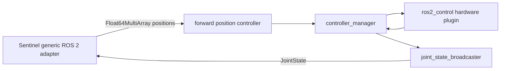

Use this pattern when `ros2_control` already owns the hardware. Sentinel continuously publishes position targets to a forward position controller and reads measured state from the joint-state broadcaster.

<Warning>
  Use `forward_command_controller/ForwardCommandController` for this integration. A `joint_trajectory_controller` owns trajectory timing and execution semantics that do not match Sentinel's continuous position-target stream.
</Warning>

## Data flow



## Controller configuration

This single-arm OpenArm example uses a joint-state broadcaster and a forward command controller configured for the position interface.

```yaml
controller_manager:
  ros__parameters:
    update_rate: 500

    joint_state_broadcaster:
      type: joint_state_broadcaster/JointStateBroadcaster

    arm_controller:
      type: forward_command_controller/ForwardCommandController

arm_controller:
  ros__parameters:
    joints:
      - openarm_joint1
      - openarm_joint2
      - openarm_joint3
      - openarm_joint4
      - openarm_joint5
      - openarm_joint6
      - openarm_joint7
    interface_name: position
```

The controller subscribes to `/arm_controller/commands` using `std_msgs/Float64MultiArray`. Array values follow the exact order of `arm_controller.ros__parameters.joints`.

<Warning>
  A forward controller command contains no joint names. The controller joint list and the Sentinel `joint_names` list must have the same joints in the same order.
</Warning>

## Launch file

The launch file starts `robot_state_publisher`, `controller_manager`, and both controllers. Replace the description and controller paths with the ones from your package.

```python
from launch import LaunchDescription
from launch_ros.actions import Node
from launch.substitutions import Command, FindExecutable, PathJoinSubstitution
from launch_ros.substitutions import FindPackageShare


def generate_launch_description():
    description_package = FindPackageShare("openarm_description")
    control_package = FindPackageShare("openarm_control")

    robot_description = {
        "robot_description": Command([
            FindExecutable(name="xacro"),
            " ",
            PathJoinSubstitution([
                description_package,
                "urdf",
                "openarm.urdf.xacro",
            ]),
        ])
    }

    controllers = PathJoinSubstitution([
        control_package,
        "config",
        "controllers.yaml",
    ])

    return LaunchDescription([
        Node(
            package="robot_state_publisher",
            executable="robot_state_publisher",
            parameters=[robot_description],
            output="screen",
        ),
        Node(
            package="controller_manager",
            executable="ros2_control_node",
            parameters=[robot_description, controllers],
            output="screen",
        ),
        Node(
            package="controller_manager",
            executable="spawner",
            arguments=["joint_state_broadcaster", "--controller-manager", "/controller_manager"],
        ),
        Node(
            package="controller_manager",
            executable="spawner",
            arguments=["arm_controller", "--controller-manager", "/controller_manager"],
        ),
    ])
```

## Sentinel mapping

```yaml
adapters:
  - id: arm
    plugin: sentinel_adapter_ros2_bridge::Ros2BridgeAdapter
    description:
      source: parameter
      node: /robot_state_publisher
      parameter: robot_description
      timeout_s: 10.0
    bridge:
      manipulator:
        enabled: true
        capability_id: arm
        command:
          outputs:
            - topic: /arm_controller/commands
              qos: reliable
              joint_names:
                - openarm_joint1
                - openarm_joint2
                - openarm_joint3
                - openarm_joint4
                - openarm_joint5
                - openarm_joint6
                - openarm_joint7
        state:
          topic: /joint_states
          qos: sensor
          stale_timeout_s: 0.5
```

Check the exact command topic with `ros2 topic list`. Confirm that it uses `std_msgs/msg/Float64MultiArray` and that the forward controller is the only hardware command owner.

## Anvil OpenArm Devbox

An Anvil Devbox already runs its own controller manager, forward position controllers, and hardware loop. Do not launch a second `ros2_control_node` against the same arms. Run the Devbox stack, put it in the same ROS domain as Sentinel, and map one Sentinel array output to each Devbox forward-position command topic.

| Arm | Devbox command topic |
| --- | --- |
| Left | `/follower_l_forward_position_controller/commands` |
| Right | `/follower_r_forward_position_controller/commands` |

Each Devbox command is a `Float64MultiArray`. Its slot order must match the corresponding controller configuration.

<Warning>
  Never run the Devbox controller and a second raw-CAN hardware driver against the same arms. That creates two hardware owners.
</Warning>

The Devbox example is a same-domain integration in the current release. Use [DDS and container networking](/ros2/networking) to configure discovery across the Devbox and Sentinel computers.

## Startup order

<Steps>
  <Step title="Start the hardware and controller manager">
    Wait for the hardware plugin and controllers to become active.
  </Step>
  <Step title="Start the joint-state broadcaster">
    Confirm that `/joint_states` is publishing every controlled joint.
  </Step>
  <Step title="Start the command controller">
    Confirm that `/arm_controller/commands` has one `Float64MultiArray` subscriber and that the configured joint order matches Sentinel.
  </Step>
  <Step title="Start Sentinel">
    Keep the robot disarmed until state, QoS, and command discovery are verified from the Sentinel container.
  </Step>
</Steps>

Controller-manager service calls and lifecycle-aware startup are planned additions. The current integration depends on starting the ROS 2 control stack before Sentinel.
