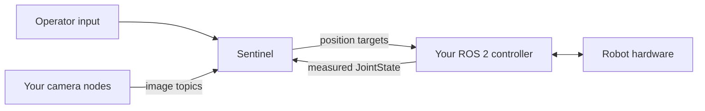

Keep your existing robot driver or controller in place. Sentinel connects to it through ROS 2:

- Your stack publishes measured robot state and camera frames.
- Sentinel publishes live position targets and other configured commands.
- Your stack remains responsible for hardware communication, command execution, and hardware safety.



<Warning>
  Sentinel does not replace the robot's hardware safety system. Your controller must enforce the joint, velocity, workspace, watchdog, fault, and emergency-stop behavior required by your robot.
</Warning>

## Choose your path

Start from the path that matches the stack you already run.

<Columns cols={3}>
  <Card title="Existing ros2_control stack" icon="diagram-project" href="/ros2/examples/ros2-control">
    Connect Sentinel to a forward position controller and joint-state broadcaster.
  </Card>
  <Card title="Anvil OpenArm Devbox" icon="robot" href="/ros2/examples/anvil-openarm-devbox">
    Keep the Devbox in control of the hardware and bridge its existing topics.
  </Card>
  <Card title="Vendor SDK or custom driver" icon="code" href="/ros2/examples/vendor-sdk-adapter">
    Wrap the hardware loop in a small ROS 2 node that implements the Sentinel boundary.
  </Card>
</Columns>

If your controller already publishes measured joint state and accepts one of the supported command types, you do not need a new driver. Configure the topics directly in Sentinel.

## Systems and robots

The top-level `systems` list models the independently controlled robots in one Sentinel setup. Give each physical robot that needs its own namespace and control lifecycle a separate system. Keep related capabilities together when they belong to the same logical robot.

| Physical setup | Suggested Sentinel model |
| --- | --- |
| One arm with a gripper | One system with manipulator and gripper capabilities |
| Bimanual robot | Two systems, such as `arm_left` and `arm_right` |
| Two arms and an independent neck | Three systems with separate namespaces |

Each system declares its adapters, capabilities, safety settings, state machine, and lifecycle orchestration. Every manipulator system needs its own complete measured-state stream before Sentinel starts.

## Before you integrate

Verify your stack without Sentinel first:

- The robot can enter its normal ready state.
- A physical emergency stop is installed and tested.
- The controller stops or holds safely when commands stop.
- A URDF is available from a file, parameter, or transient-local topic.
- `sensor_msgs/msg/JointState` contains every controlled joint.
- You know the command topic, message type, joint names, and joint order.
- Each camera you want in Sentinel publishes a stable ROS 2 image topic.

Do not continue until a small controller-native command works in a cleared workspace.

## Integration flow

<Steps titleSize="h3">
  <Step title="Make the ROS graph visible to Sentinel">
    Put Sentinel and your stack on a discoverable DDS network. Use the same `ROS_DOMAIN_ID` for robot control topics, then verify discovery from the environment that will run Sentinel.

    [Configure and test DDS networking →](/ros2/networking)
  </Step>

  <Step title="Publish measured robot state">
    Publish every controlled joint in `sensor_msgs/msg/JointState` continuously. Names and values must remain aligned, positions must use radians, and the stream must continue while the robot is idle.

    Sentinel uses this stream for initialization, kinematics, safety checks, and stale-state fault detection.
  </Step>

  <Step title="Connect the command interface">
    Choose the output your controller already accepts:

    - `std_msgs/msg/Float64MultiArray` for a continuous forward position controller.
    - `trajectory_msgs/msg/JointTrajectory` for a named trajectory command endpoint.

    Declare the fixed slot order for every nameless array. Use joint mapping when external names, signs, or offsets differ from the Sentinel model.

    [Configure robot state and commands →](/ros2/control-interface)
  </Step>

  <Step title="Connect one camera">
    Start with one operator view. Prefer compressed image transport across computers or containers. Confirm the source rate, timestamps, orientation, and end-to-end latency before adding more cameras.

    [Configure ROS 2 cameras →](/ros2/camera-interface)
  </Step>

  <Step title="Create the Sentinel configuration">
    Start with [`ros2_single_arm.yaml`](/configs/ros2_single_arm.yaml) or [`ros2_dual_arm.yaml`](/configs/ros2_dual_arm.yaml). Fill in the URDF source, state topic, command topic or array outputs, joint names, limits, and camera topics.

    [Understand the full robot configuration →](/getting-started/configure-robot)
  </Step>

  <Step title="Validate before arming">
    From the Sentinel environment, verify:

    ```bash
    ros2 topic hz /robot/joint_states
    ros2 topic echo /robot/joint_states --once
    ros2 topic info --verbose /robot/joint_states
    ros2 topic info --verbose /robot/command
    ```

    Test with one arm and one camera first. Keep Sentinel disarmed until state, command discovery, QoS, joint ordering, and limits are verified.
  </Step>

  <Step title="Start Sentinel">
    Start your hardware stack before Sentinel. Then launch Sentinel with the completed `robot.yaml`, confirm the robot and camera appear, and follow the [first-session flow](/getting-started/quickstart).
  </Step>
</Steps>

## Interface at a glance

| Direction | Interface | Requirement |
| --- | --- | --- |
| Your stack → Sentinel | `sensor_msgs/msg/JointState` | Required for every controlled manipulator |
| Sentinel → your stack | `std_msgs/msg/Float64MultiArray` | Forward position targets in a fixed configured order |
| Sentinel → your stack | `trajectory_msgs/msg/JointTrajectory` | Named position targets |
| Your stack → Sentinel | ROS image transport | Optional raw, compressed, or compressed-depth camera feed |
| Sentinel → your stack | `geometry_msgs/msg/Twist` | Optional mobile-base command |

The generic bridge also supports configured gripper, neck, hand, elevator, and PTZ interfaces. Establish the measured-state and arm-command path before adding optional capabilities.

<Check>
  The integration boundary is ready when Sentinel can observe every controlled joint, your controller receives a small correctly ordered target, and command loss leaves the robot in its validated safe behavior.
</Check>
