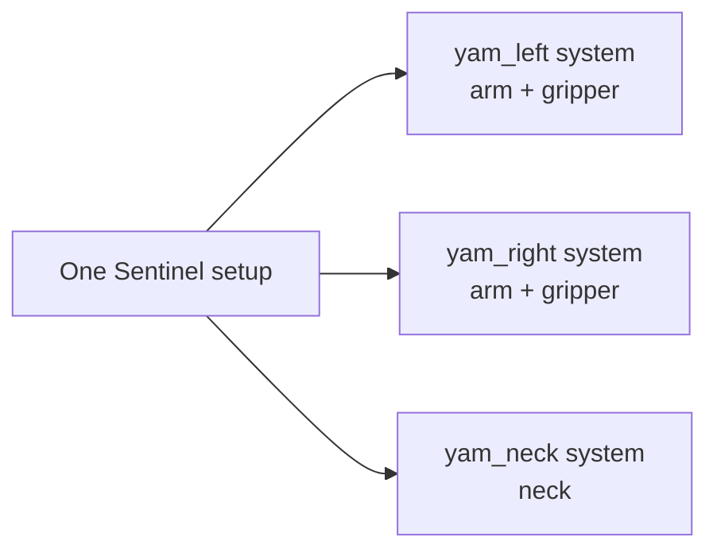
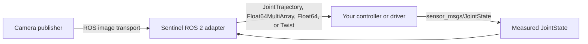

Sentinel exposes a ROS 2 control boundary for robots that already have a ROS 2 driver or controller. Sentinel publishes commands. Your robot publishes measured state and camera frames.

You do not need to move your hardware driver into the Sentinel container. Keep the driver, `ros2_control` stack, or vendor SDK where it already runs and connect its ROS 2 interfaces to the Sentinel adapter.

<Warning>
  **Publish `sensor_msgs/JointState` before starting Sentinel.** Sustain at least 100 Hz while the robot is running, including while it is idle or disarmed. If the stream goes stale for 500 ms, Sentinel treats the robot state as unsafe and triggers an E-stop.
</Warning>

## Systems and robots

A Sentinel setup can control more than one physical robot. The top-level `systems` list describes the independently namespaced control systems that Sentinel starts and coordinates.

Each system has:

- A unique namespace
- One or more hardware or ROS 2 adapters
- Capabilities such as an arm, gripper, neck, mobile base, or hand
- Its own description, state, commands, and safety configuration

For example, one setup can contain two YAM arms and a separate neck:

| System | Namespace | Capabilities |
| --- | --- | --- |
| YAM Left | `yam_left` | Left manipulator and gripper |
| YAM Right | `yam_right` | Right manipulator and gripper |
| YAM Neck | `yam_neck` | Neck |

This is still one operator setup and one data-collection setup. Namespaces keep the control and state topics separate. Sentinel can arm, disarm, and coordinate actions across the configured systems.

You can also put several capabilities in one system when they belong to the same logical robot. For example, a single system can contain an arm adapter and a neck adapter. Split hardware into separate systems when it needs an independent namespace and control lifecycle.

Every system with a manipulator must receive its required measured joint-state stream before Sentinel starts. Each stream must meet the same 100 Hz and 500 ms staleness requirements.

## Interface at a glance

| Capability | Sentinel publishes | Your system publishes |
| --- | --- | --- |
| Arm | `trajectory_msgs/JointTrajectory` or `std_msgs/Float64MultiArray` | `sensor_msgs/JointState` |
| Gripper | `trajectory_msgs/JointTrajectory`, `std_msgs/Float64`, or `std_msgs/Float64MultiArray` | `sensor_msgs/JointState` when available |
| Mobile base | `geometry_msgs/Twist` | Integration-specific state |
| Camera | — | Raw, compressed, or compressed-depth ROS image transport |

The adapter can remap joint names and apply per-joint scale, sign, and offset transforms. Configure QoS for each robot topic so it matches the existing publisher or subscriber.

## DDS domains

The Sentinel runtime runs in one configured `ROS_DOMAIN_ID`. The current generic robot adapter joins that domain. Robot command and state topics must therefore be discoverable in the Sentinel domain.

Camera behavior depends on the adapter:

- The `image_transport` adapter joins the Sentinel domain.
  - The dedicated compressed-camera domain bridge can subscribe in a separate source domain.

This means a camera can currently come from another domain, but the released generic robot adapter cannot yet pull arm topics from an arbitrary second domain. See [DDS and container networking](/ros2/networking) for working topologies.

## Choose an integration path

<Columns cols={2}>
  <Card title="Implement the control topics" icon="sliders" href="/ros2/control-interface">
    Configure commands, measured state, joint mapping, and QoS.
  </Card>
  <Card title="Use ros2_control" icon="diagram-project" href="/ros2/examples/ros2-control">
    Connect a controller manager and standard ROS 2 controllers.
  </Card>
  <Card title="Wrap a vendor SDK" icon="code" href="/ros2/examples/i2rt-adapter">
    See a complete adapter pattern built around an I2RT-controlled arm.
  </Card>
  <Card title="Connect cameras" icon="video" href="/ros2/camera-interface">
    Choose raw or compressed image transport and validate latency.
  </Card>
</Columns>

<Warning>
  Sentinel commands do not replace hardware safety. Your controller must enforce joint, velocity, workspace, watchdog, and emergency-stop behavior appropriate for the robot.
</Warning>
